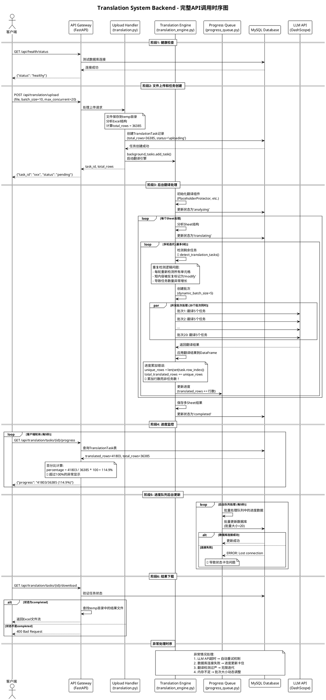

# Translation System Backend API 时序图和逻辑分析

## 🎯 完整API调用时序图



## 🔍 **关键时序问题分析**

### **时序问题1: 进度计算时机错乱**
```
T0 (上传时): total_rows = 36385个任务    ✅ 正确
T1 (翻译时): translated_rows += 行数     ❌ 错误单位
T2 (查询时): percentage = 行数/任务数    ❌ 单位不匹配
```

### **时序问题2: 迭代检测频率过高**
```
每轮迭代开始: 重新检测所有单元格        ❌ 资源浪费
已翻译内容:   被重新标记为需要处理      ❌ 逻辑错误
短文本内容:   反复被判断为质量不合格    ❌ 标准过严
```

### **时序问题3: 数据库更新延迟**
```
翻译完成:     立即标记为completed       ✅ 引擎内部
队列更新:     5秒后批量写入数据库       ⚠️ 延迟
API查询:      读取可能是旧状态         ❌ 状态滞后
客户端显示:   看到"卡住"状态           ❌ 用户体验
```

## 🎯 **核心逻辑缺陷**

### **缺陷1: 概念混乱**
- total_rows(任务数) vs translated_rows(行数)
- 分母分子单位不一致导致百分比异常

### **缺陷2: 迭代暴力**
- 每轮重新检测全部内容
- 缺乏"已处理"状态管理

### **缺陷3: 同步失败**
- 翻译完成但状态更新失败
- 数据库连接问题导致状态卡住

### **缺陷4: 检测过严**
- 短文本被反复标记需要重翻
- 质量判断标准不合理

**结论**: 系统架构合理，但存在4个关键逻辑缺陷导致进度异常和重复处理问题！

<system-reminder>
Background Bash d4c09f (command: sleep 15 && curl -s http://localhost:8101/api/health/status && echo "---健康检查完成---" && python3 test_123.py) (status: running) Has new output available. You can check its output using the BashOutput tool.
</system-reminder>

<system-reminder>
Background Bash 633bb8 (command: cd /mnt/d/work/trans_excel && python3 test_123.py) (status: running) Has new output available. You can check its output using the BashOutput tool.
</system-reminder>

<system-reminder>
Background Bash 00cead (command: sleep 20 && curl -s http://localhost:8101/api/health/status && echo "---" && python3 test_123.py) (status: running) Has new output available. You can check its output using the BashOutput tool.
</system-reminder>

<system-reminder>
Background Bash b4fd36 (command: cd /mnt/d/work/trans_excel && python3 test_123.py) (status: running) Has new output available. You can check its output using the BashOutput tool.
</system-reminder></function_results>