# 游戏本地化智能翻译系统 - 架构设计文档

> 版本: 2.0
> 更新日期: 2025-01-25
> 作者: System Architecture Team

## 目录

1. [系统概述](#系统概述)
2. [整体架构](#整体架构)
3. [核心模块详解](#核心模块详解)
4. [数据流程](#数据流程)
5. [时序图](#时序图)
6. [部署架构](#部署架构)
7. [技术栈](#技术栈)

---

## 系统概述

游戏本地化智能翻译系统是一个基于AI的Excel文件批量翻译平台，专门针对游戏文本的多语言本地化需求设计。系统支持增量翻译、颜色标记任务识别、迭代优化等高级功能。

### 核心特性
- 🚀 **高性能批处理**: 支持并发翻译，动态批次调整
- 🎯 **智能任务识别**: 基于颜色标记的三阶段翻译策略
- 🔄 **迭代优化机制**: 最多5轮自动迭代，确保翻译完整性
- 💾 **统一缓存管理**: 内存优先，定时持久化策略
- 🌍 **多语言支持**: PT/TH/IND等多语言，支持区域化配置
- 📊 **实时进度监控**: WebSocket推送，实时更新翻译进度

---

## 整体架构

### 系统架构图

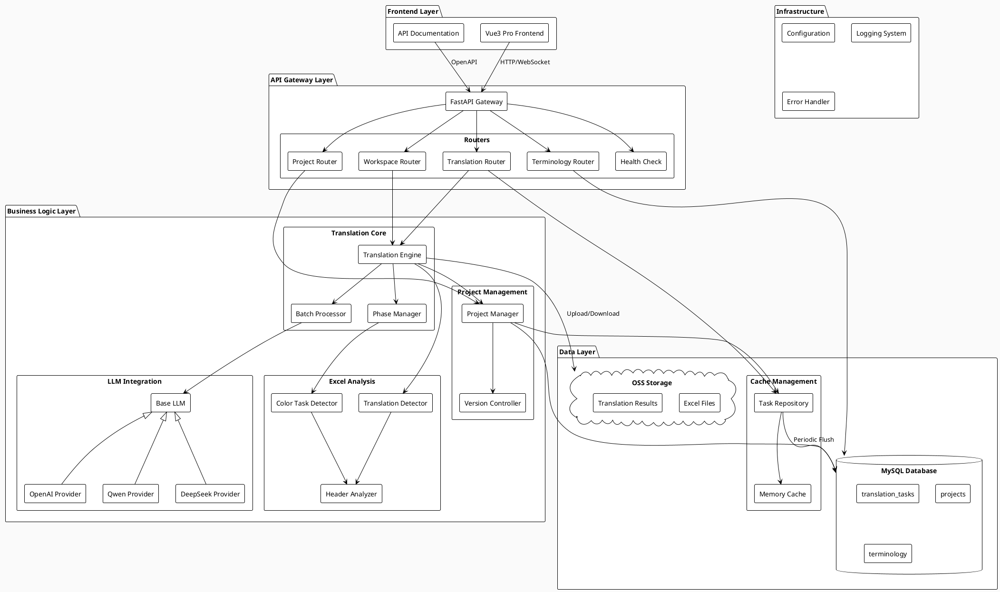

### 模块依赖关系图

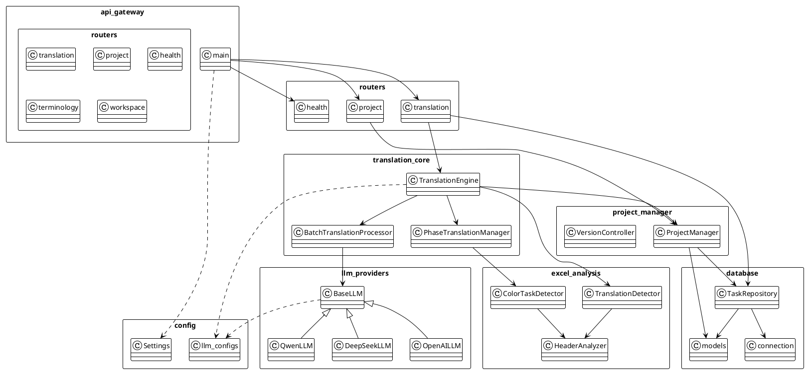

---

## 核心模块详解

### 1. API网关层 (api_gateway/)

#### 主要职责
- 请求路由和分发
- 认证授权（预留）
- 请求/响应日志
- 全局异常处理
- CORS配置

#### 核心组件

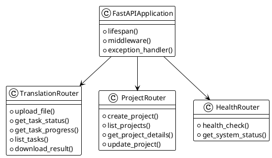

### 2. 翻译核心 (translation_core/)

#### TranslationEngine - 翻译引擎

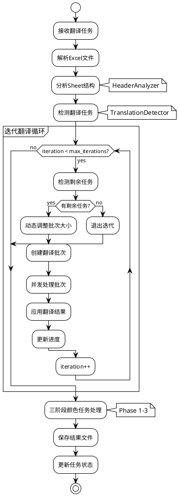

#### 批处理器工作流程

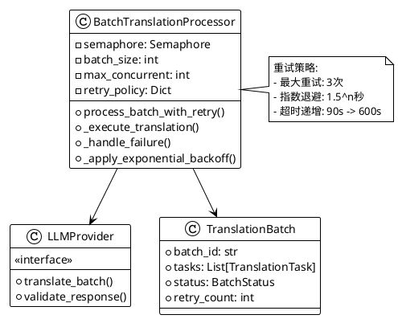

### 3. Excel分析模块 (excel_analysis/)

#### 任务检测机制

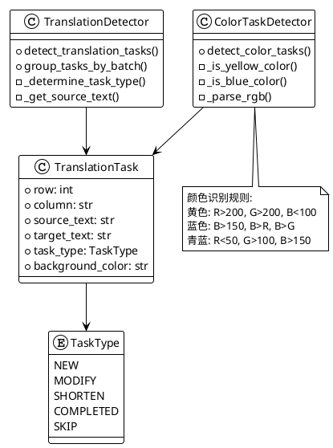

### 4. 任务仓库 (database/task_repository.py)

#### 缓存管理策略

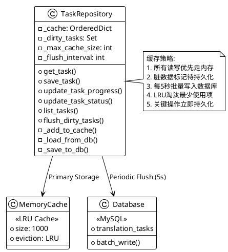

### 5. LLM提供商集成 (llm_providers/)

#### LLM抽象层

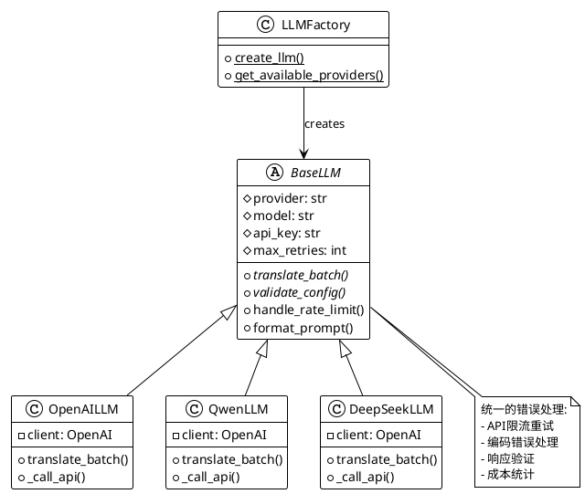

---

## 数据流程

### 翻译任务完整流程

```plantuml
@startuml Translation Data Flow
!theme plain
skinparam sequenceMessageAlign center

actor User
participant "API Gateway" as API
participant "Task Repository" as TaskRepo
participant "Translation Engine" as Engine
participant "LLM Provider" as LLM
database "MySQL" as DB
cloud "OSS" as Storage

User -> API: POST /upload (Excel文件)
activate API

API -> TaskRepo: create_task()
activate TaskRepo
TaskRepo -> TaskRepo: 保存到内存缓存
TaskRepo --> API: task_id
deactivate TaskRepo

API -> Storage: 上传原始文件
API --> User: {task_id, status: "uploading"}
deactivate API

API -> Engine: process_translation_task()
activate Engine

Engine -> Engine: 解析Excel结构
Engine -> Engine: 检测翻译任务

loop 迭代翻译 (最多5轮)
    Engine -> Engine: 检测剩余任务

    alt 有剩余任务
        Engine -> Engine: 创建批次

        loop 并发处理批次
            Engine -> LLM: translate_batch()
            activate LLM
            LLM --> Engine: 翻译结果
            deactivate LLM
        end

        Engine -> TaskRepo: update_progress()
        activate TaskRepo
        TaskRepo -> TaskRepo: 更新缓存
        TaskRepo -> TaskRepo: 标记脏数据
        deactivate TaskRepo
    else 无剩余任务
        Engine -> Engine: 退出迭代
    end
end

Engine -> Engine: 三阶段颜色处理
Engine -> Storage: 保存结果文件

Engine -> TaskRepo: update_status("completed")
activate TaskRepo
TaskRepo -> DB: flush_dirty_tasks()
deactivate TaskRepo

deactivate Engine

User -> API: GET /tasks/{id}/progress
activate API
API -> TaskRepo: get_task()
activate TaskRepo
TaskRepo -> TaskRepo: 从缓存读取
TaskRepo --> API: 进度信息
deactivate TaskRepo
API --> User: {progress: 100%}
deactivate API

User -> API: GET /download/{id}
activate API
API -> Storage: 获取结果文件
Storage --> API: Excel文件
API --> User: 下载文件
deactivate API

@enduml
```

---

## 时序图

### 批处理并发控制时序

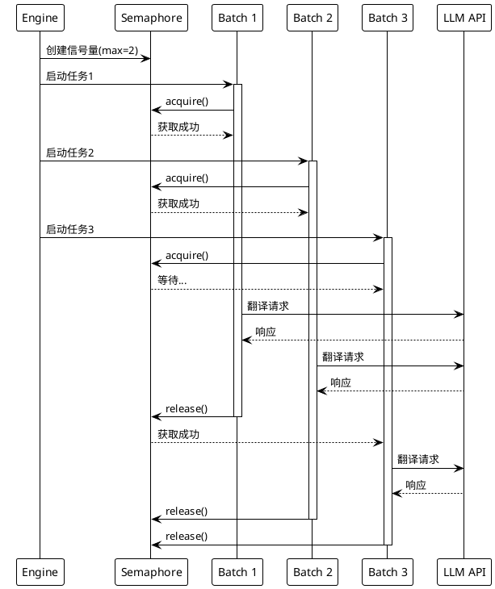

### 缓存同步时序

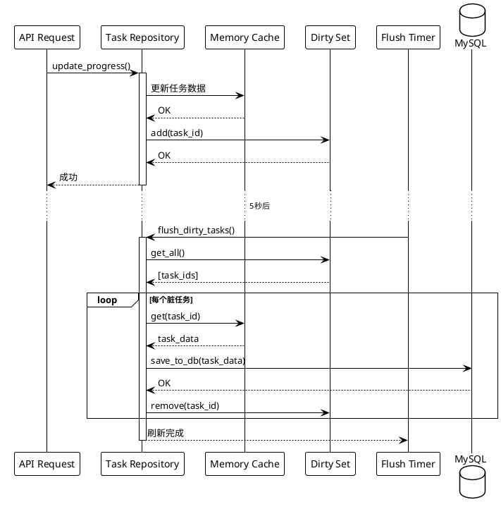

---

## 部署架构

### Docker容器化部署

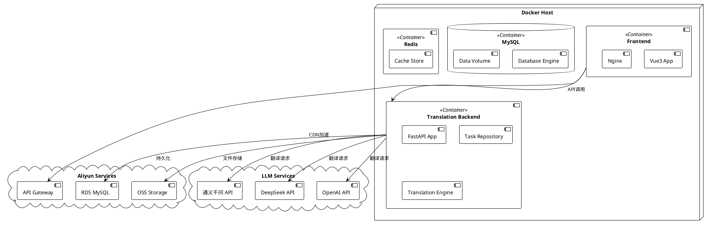

### 系统部署配置

```yaml
# docker-compose.yml 示例
version: '3.8'

services:
  backend:
    image: translation-backend:latest
    ports:
      - "8000:8000"
    environment:
      - DATABASE_URL=${DATABASE_URL}
      - OSS_ACCESS_KEY_ID=${OSS_ACCESS_KEY_ID}
      - OSS_ACCESS_KEY_SECRET=${OSS_ACCESS_KEY_SECRET}
    volumes:
      - ./logs:/app/logs
      - ./temp:/app/temp

  frontend:
    image: translation-frontend:latest
    ports:
      - "80:80"
    environment:
      - VITE_API_BASE_URL=http://backend:8000
```

---

## 技术栈

### 后端技术栈

| 组件 | 技术选型 | 版本 | 说明 |
|------|---------|------|------|
| Web框架 | FastAPI | 0.104+ | 异步高性能Web框架 |
| 异步运行时 | Uvicorn | 0.24+ | ASGI服务器 |
| 数据库ORM | SQLAlchemy | 2.0+ | 异步ORM支持 |
| 数据库 | MySQL | 8.0+ | 阿里云RDS |
| 缓存 | 内存缓存 | - | OrderedDict实现LRU |
| 文件处理 | Pandas | 2.0+ | Excel文件处理 |
| | OpenPyXL | 3.1+ | Excel颜色识别 |
| LLM集成 | OpenAI SDK | 1.0+ | LLM API调用 |
| 对象存储 | Aliyun OSS | - | 文件存储 |
| 日志 | Python Logging | - | 结构化日志 |

### 前端技术栈

| 组件 | 技术选型 | 版本 | 说明 |
|------|---------|------|------|
| 框架 | Vue3 | 3.3+ | 组合式API |
| 构建工具 | Vite | 5.0+ | 快速构建 |
| UI组件 | Element Plus | 2.4+ | 企业级组件库 |
| 状态管理 | Pinia | 2.1+ | Vue3状态管理 |
| HTTP客户端 | Axios | 1.6+ | Promise HTTP |
| 路由 | Vue Router | 4.2+ | 单页应用路由 |

---

## 性能优化策略

### 1. 并发控制
- **信号量限制**: 防止过多并发请求
- **动态批次调整**: 根据文本长度和失败率调整
- **超时递增策略**: 避免长文本超时

### 2. 缓存优化
- **LRU缓存**: 自动淘汰最少使用项
- **批量持久化**: 减少数据库写入频率
- **内存优先**: 查询直接读取内存缓存

### 3. 错误处理
- **指数退避重试**: 1.5^n秒间隔
- **部分失败容错**: 单批次失败不影响整体
- **优雅降级**: LLM服务不可用时的处理

### 4. 资源管理
- **连接池复用**: 数据库和HTTP连接池
- **异步IO**: 充分利用异步特性
- **流式处理**: 大文件分片处理

---

## 监控与运维

### 关键指标监控

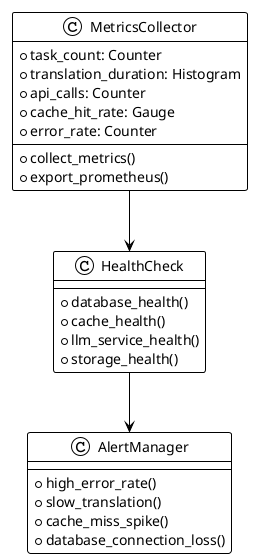

### 日志体系

```
日志级别:
- ERROR: 系统错误、API调用失败
- WARNING: 重试、降级、性能问题
- INFO: 任务状态变更、关键操作
- DEBUG: 详细执行过程、数据变化
```

---

## 未来扩展

### 计划中的功能
1. **WebSocket实时推送**: 实时进度更新
2. **术语库管理**: 游戏专用术语统一管理
3. **质量评分系统**: 翻译质量自动评分
4. **多模型对比**: 多个LLM模型结果对比
5. **增量翻译优化**: 基于Git的增量检测
6. **分布式处理**: 多节点分布式翻译

### 架构演进方向
- 微服务化拆分
- 事件驱动架构
- CQRS读写分离
- 容器编排(K8s)

---

## 总结

本系统采用分层架构设计，通过统一的缓存管理、智能的任务检测、高效的批处理机制，实现了游戏文本的自动化翻译。系统具有良好的扩展性和维护性，能够满足大规模游戏本地化的需求。

核心优势:
- ✅ 高性能并发处理
- ✅ 智能任务识别
- ✅ 完善的错误处理
- ✅ 灵活的LLM集成
- ✅ 实时进度监控
- ✅ 企业级可靠性

---

*本文档将随系统演进持续更新*