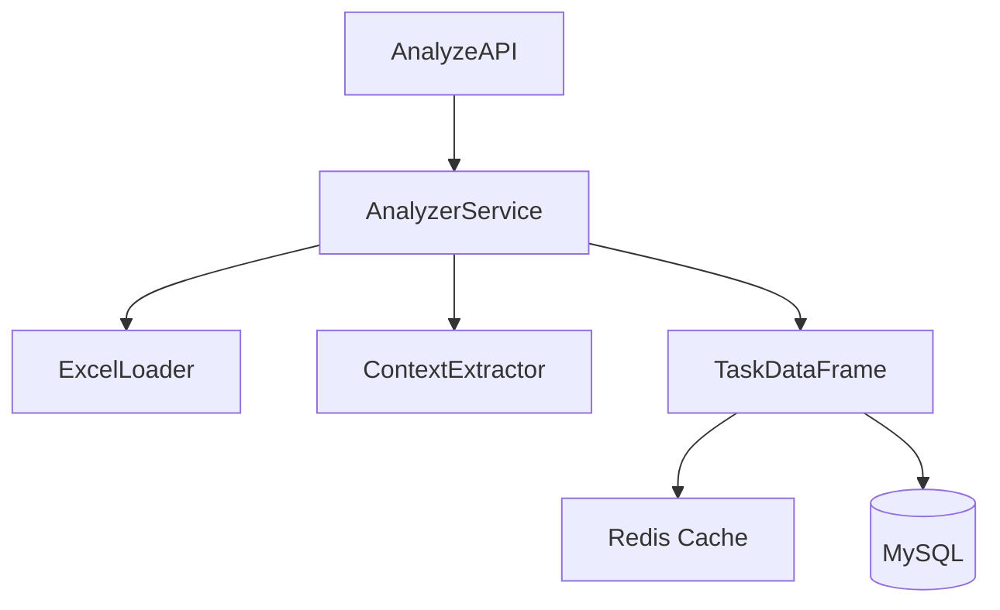

# Backend Spec 集成示例

## 🎯 目标
将 translation_system/backend_v2 迁移到 spec-driven 架构

## 📝 Step-by-Step 集成步骤

### Step 1: 安装和初始化

```bash
# 1. 进入项目目录
cd /mnt/d/work/trans_excel/translation_system/backend_spec

# 2. 安装 spec-workflow
npm i -g @pimzino/claude-code-spec-workflow

# 3. 初始化（创建 .claude 目录结构）
claude-code-spec-workflow

# 输出：
# ✅ Created .claude directory structure
# ✅ Installed slash commands
# ✅ Ready to use /spec-create command
```

### Step 2: 在 Claude Code 中设置项目指导

打开 Claude Code，在项目根目录执行：

```
/spec-steering-setup
```

系统会创建三个文件，编辑它们：

#### .claude/steering/product.md
```markdown
# Product Vision

## Translation System Backend

### 目标
构建高性能的 Excel 翻译管理系统，支持大规模文件处理和并发翻译。

### 核心价值
- 处理百万级单元格
- 实时进度追踪
- 智能任务分配
- 错误自动恢复

### 用户群体
- 翻译项目经理
- 翻译执行团队
- 系统管理员
```

#### .claude/steering/tech.md
```markdown
# Technical Standards

## 技术栈
- **Framework**: FastAPI 0.104+
- **Data Processing**: pandas 2.0+
- **Database**: MySQL 8.0+ with SQLAlchemy
- **Cache**: Redis
- **Testing**: pytest with 80%+ coverage

## 编码标准
- Type hints for all public functions
- Google style docstrings
- Error handling with proper logging
- Async/await for I/O operations

## 性能要求
- API response < 100ms (P95)
- Handle 1M cells < 30s
- Support 100+ concurrent tasks
```

#### .claude/steering/structure.md
```markdown
# Project Structure

## Directory Layout
```
backend_spec/
├── api/          # API endpoints (FastAPI routers)
├── models/       # Data models and schemas
├── services/     # Business logic
├── database/     # Database operations
├── utils/        # Utilities and helpers
└── tests/        # Test files
```

## Naming Conventions
- Files: snake_case.py
- Classes: PascalCase
- Functions: snake_case
- Constants: UPPER_CASE

## Module Organization
- One router per API module
- Services contain business logic
- Models define data structures
- Utils for shared functionality
```

### Step 3: 创建第一个功能规范

在 Claude Code 中执行：

```
/spec-create excel-analyzer "Excel文件分析功能，自动识别需翻译内容，提取颜色标记和注释"
```

### 系统会自动执行的流程

#### Phase 1: 代码库分析
```
🔍 Analyzing existing codebase...
- Found similar module: backend_v2/services/excel_analyzer.py
- Found utilities: excel_loader.py, context_extractor.py
- Found patterns: DataFrame usage, color detection logic
```

#### Phase 2: 需求生成
```markdown
# Requirements Document

## Introduction
Excel分析功能用于自动识别和提取需要翻译的内容...

## Requirements

### Requirement 1: 文件上传和验证
**User Story:** 作为翻译管理员，我希望上传Excel文件并自动验证格式

#### Acceptance Criteria
1. WHEN 用户上传Excel文件 THEN 系统 SHALL 验证文件格式
2. IF 文件格式不正确 THEN 系统 SHALL 返回详细错误信息
3. WHEN 文件大小超过100MB THEN 系统 SHALL 使用流式处理

### Requirement 2: 内容识别
**User Story:** 作为翻译管理员，我希望自动识别需翻译的单元格

#### Acceptance Criteria
1. WHEN 单元格包含中文 THEN 系统 SHALL 标记为需翻译
2. IF 单元格有颜色标记 THEN 系统 SHALL 记录颜色信息
3. WHEN 单元格有注释 THEN 系统 SHALL 提取注释作为上下文
```

**Claude 询问**: "需求文档已生成，是否继续生成设计文档？(yes/no)"

#### Phase 3: 设计生成（确认后）
```markdown
# Design Document

## Architecture Overview

### Component Diagram


## API Design
- POST /api/analyze/upload
- GET /api/analyze/status/{session_id}
- GET /api/analyze/result/{session_id}

## Data Models
```python
class AnalysisResult:
    session_id: str
    total_cells: int
    translatable_cells: int
    color_markers: Dict[str, int]
    context_data: List[ContextInfo]
```
```

**Claude 询问**: "设计文档已生成，是否继续生成任务列表？(yes/no)"

#### Phase 4: 任务生成（确认后）
```markdown
# Tasks Document

## Task Breakdown

### Task 1: Create upload API endpoint
**Priority:** High
**Type:** API Development
**Test First:** Yes

Implementation steps:
1. Write test for file upload endpoint
2. Create FastAPI router
3. Add file validation
4. Handle large files with streaming

### Task 2: Implement Excel loader service
**Priority:** High
**Type:** Service Development
**Dependencies:** Task 1

Implementation steps:
1. Write unit tests for loader
2. Implement pandas-based loader
3. Add memory optimization
4. Handle multiple sheets

### Task 3: Create context extractor
**Priority:** Medium
**Type:** Service Development
**Dependencies:** Task 2

Implementation steps:
1. Write tests for color detection
2. Implement color extraction logic
3. Add comment extraction
4. Create context aggregation
```

**Claude 询问**: "是否需要生成任务命令？(yes/no)"

### Step 4: 执行实现

如果选择生成命令，可以使用：

```bash
# 自动生成的任务命令
/excel-analyzer-task-1    # 创建上传API
/excel-analyzer-task-2    # 实现加载器
/excel-analyzer-task-3    # 创建上下文提取器

# 或手动执行
/spec-execute 1 excel-analyzer
```

### Step 5: 查看进度

```bash
# 查看所有规范状态
/spec-status

# 输出示例：
📊 Spec Status Dashboard
========================
excel-analyzer:
  ✅ Requirements: Complete
  ✅ Design: Complete
  🔄 Tasks: In Progress (1/3)
  - [✅] Task 1: Create upload API endpoint
  - [🔄] Task 2: Implement Excel loader service
  - [⏳] Task 3: Create context extractor
```

## 🎯 实际执行示例

### 示例对话

```
User: /spec-create batch-translator "批量翻译执行器，支持并发处理和进度追踪"

Claude: 我正在创建批量翻译执行器的规范...

🔍 分析现有代码库...
- 找到相关模块: backend_v2/services/executor/batch_executor.py
- 发现可复用组件: batch_optimizer.py, progress_tracker.py
- 识别到模式: 使用 asyncio 进行并发控制

📝 生成需求文档...

[显示需求文档]

需求文档已生成。主要包括：
1. 批量任务管理
2. 并发执行控制
3. 实时进度追踪
4. 错误处理和重试

是否继续生成设计文档？(yes/no)

User: yes

Claude: 📐 生成技术设计...

[显示设计文档，包含架构图]

设计完成。采用生产者-消费者模式，使用 Redis 队列和 asyncio 并发。
是否继续生成任务列表？(yes/no)

User: yes

Claude: 📋 分解任务...

[显示任务列表]

已生成6个任务：
1. 创建批量任务API
2. 实现任务队列
3. 开发执行器服务
4. 添加进度追踪
5. 实现错误处理
6. 编写集成测试

是否需要生成任务命令？(yes/no)

User: yes

Claude: ✅ 任务命令已生成！

可以使用以下命令执行任务：
- /batch-translator-task-1 (创建API)
- /batch-translator-task-2 (任务队列)
- ...等等

或使用 /spec-execute <task-id> batch-translator 手动执行。

准备好开始实现了！使用任务命令开始第一个任务。
```

## 🚀 监控面板使用

```bash
# 启动监控面板
claude-spec-dashboard

# 浏览器访问 http://localhost:8246
```

面板功能：
- 实时查看规范进度
- 任务执行状态
- 代码生成历史
- 性能指标

## 📋 完整工作流清单

- [ ] 安装 `@pimzino/claude-code-spec-workflow`
- [ ] 运行 `claude-code-spec-workflow` 初始化
- [ ] 执行 `/spec-steering-setup` 创建指导文档
- [ ] 编辑 product.md, tech.md, structure.md
- [ ] 使用 `/spec-create` 创建第一个功能
- [ ] 审查并确认需求文档
- [ ] 审查并确认设计文档
- [ ] 审查并确认任务列表
- [ ] 决定是否生成任务命令
- [ ] 开始执行任务
- [ ] 使用 `/spec-status` 追踪进度

## ⚡ 快速命令参考

```bash
# 功能开发
/spec-create <name> <description>   # 创建完整规范
/spec-execute <task-id> <name>      # 执行特定任务
/spec-status                         # 查看进度

# Bug 修复
/bug-create <name> <description>    # 报告bug
/bug-analyze                         # 分析原因
/bug-fix                            # 实施修复
/bug-verify                         # 验证修复

# 项目设置
/spec-steering-setup                # 创建指导文档
```

## 🎉 完成！

现在你的项目已经完全集成了 Spec-Driven Development 工作流。开始使用 `/spec-create` 命令创建你的第一个规范吧！