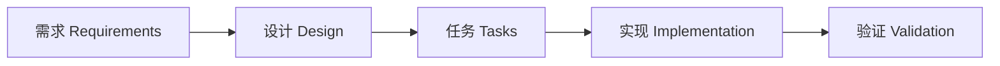

# 🚀 Translation System Backend - 快速开始指南

## ✅ 安装已完成

恭喜！`@pimzino/claude-code-spec-workflow` 已成功安装并初始化。

## 📋 可用命令

在 Claude Code 中，你现在可以使用以下命令：

### 功能开发命令
- `/spec-create` - 创建新功能规范（一键完成全流程）
- `/spec-execute` - 执行特定任务
- `/spec-status` - 查看所有规范的进度
- `/spec-list` - 列出所有规范
- `/spec-steering-setup` - 设置项目指导文档

### Bug 修复命令
- `/bug-create` - 报告新 bug
- `/bug-analyze` - 分析 bug 根因
- `/bug-fix` - 实施修复方案
- `/bug-verify` - 验证修复效果
- `/bug-status` - 查看 bug 状态

## 🎯 第一个功能示例

### 示例 1：创建 Excel 分析功能

在 Claude Code 中执行：

```
/spec-create excel-analyzer "Excel文件分析功能，自动识别需要翻译的内容，提取颜色标记和注释作为上下文"
```

系统会自动：
1. 🔍 分析现有代码库，查找相关模块
2. 📝 生成需求文档 → 询问确认
3. 📐 生成设计文档 → 询问确认
4. 📋 生成任务列表 → 询问确认
5. ⚡ 询问是否生成任务命令

### 示例 2：创建批量翻译功能

```
/spec-create batch-translator "批量翻译执行器，支持并发处理，实时进度追踪，自动错误恢复"
```

### 示例 3：创建任务管理功能

```
/spec-create task-manager "任务管理系统，支持任务拆分、优先级设置、状态追踪"
```

## 📊 工作流程



每个阶段都需要你的确认才会继续，确保质量控制。

## 🛠 开发流程

### 1. 开始新功能
```bash
/spec-create feature-name "详细描述"
```

### 2. 审查生成的文档
- 需求是否完整？
- 设计是否合理？
- 任务是否可执行？

### 3. 执行任务
```bash
# 如果生成了任务命令
/feature-name-task-1
/feature-name-task-2

# 或手动执行
/spec-execute 1 feature-name
```

### 4. 追踪进度
```bash
/spec-status
```

## 🐛 Bug 修复流程

### 1. 报告 Bug
```bash
/bug-create upload-error "文件上传失败，显示500错误"
```

### 2. 分析问题
```bash
/bug-analyze
```

### 3. 实施修复
```bash
/bug-fix
```

### 4. 验证结果
```bash
/bug-verify
```

## 📁 项目结构说明

```
backend_spec/
├── .claude/
│   ├── commands/         # ✅ 所有 slash 命令定义
│   ├── specs/           # 功能规范文档
│   │   └── {feature}/
│   │       ├── requirements.md  # 需求文档
│   │       ├── design.md       # 设计文档
│   │       └── tasks.md        # 任务列表
│   ├── bugs/            # Bug 修复记录
│   ├── steering/        # ✅ 项目指导文档
│   │   ├── product.md  # 产品愿景
│   │   ├── tech.md     # 技术标准
│   │   └── structure.md # 项目结构
│   └── templates/       # ✅ 文档模板
```

## 💡 最佳实践

### Do's ✅
1. **详细描述功能** - 提供清晰、完整的功能描述
2. **仔细审查文档** - 每个阶段都要认真审查
3. **遵循 TDD** - 先写测试，再写代码
4. **一次一个任务** - 专注完成单个任务
5. **经常查看状态** - 使用 `/spec-status` 追踪进度

### Don'ts ❌
1. **不要跳过审查** - 每个阶段都很重要
2. **不要同时执行多个任务** - 保持专注
3. **不要忽略测试** - TDD 是必须的
4. **不要手动创建文档** - 让系统自动生成
5. **不要修改模板** - 保持一致性

## 🎓 进阶使用

### 设置项目标准
如果还没有设置，运行：
```bash
/spec-steering-setup
```
这会创建三个重要文档供你编辑：
- product.md - 产品愿景
- tech.md - 技术标准
- structure.md - 项目结构

### 查看现有规范
```bash
/spec-list
```

### 监控面板
```bash
# 在终端运行（不是在 Claude Code）
claude-spec-dashboard
# 访问 http://localhost:8246
```

## 🔗 相关资源

- [官方文档](https://github.com/Pimzino/claude-code-spec-workflow)
- [NPM 包](https://www.npmjs.com/package/@pimzino/claude-code-spec-workflow)
- [项目指导文档](.claude/steering/)

## ⚠️ 重要提示

1. **重启 Claude Code** - 如果命令不可见，重启 Claude Code
2. **使用 slash 命令** - 所有操作通过 `/` 命令执行
3. **等待确认** - 每个阶段需要你的确认
4. **检查 steering** - 确保遵循项目标准

## 🎉 开始你的第一个功能！

现在就在 Claude Code 中运行：
```bash
/spec-create my-awesome-feature "我的超棒功能描述"
```

Happy Coding! 🚀