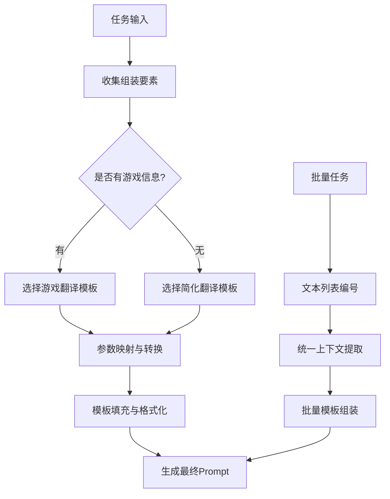
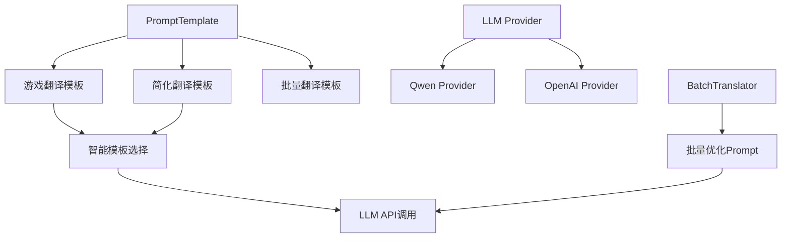
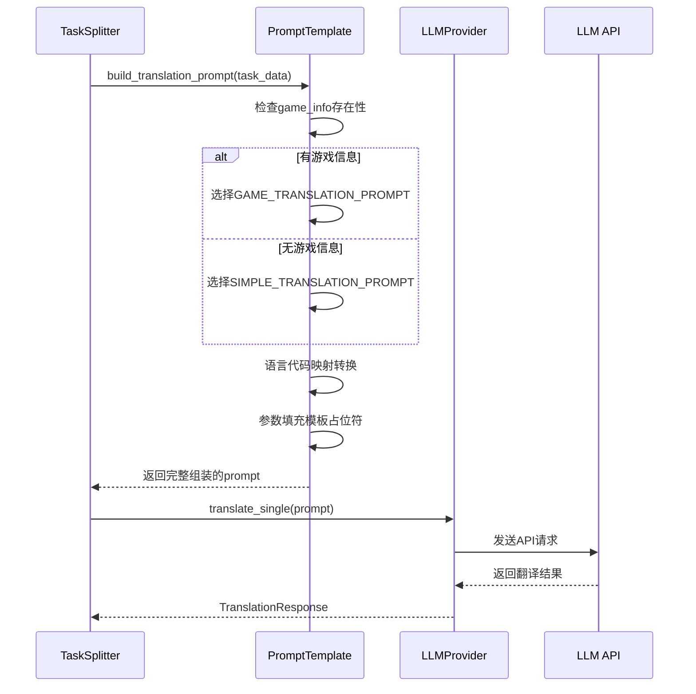

# Backend V2 提示词设计文档

## 🚀 核心提示词架构总览

### 📁 核心文件结构

```
services/llm/
├── prompt_template.py      # 🎯 核心 Prompt 模板类
├── base_provider.py        # 抽象基类定义
├── qwen_provider.py        # 通义千问 Provider
├── openai_provider.py      # OpenAI Provider
└── batch_translator.py     # 批量翻译器（含批量 Prompt）
```

### 📋 关键文件位置表

| 提示词类型 | 文件路径 | 关键方法 | 行号 |
|-----------|----------|----------|------|
| **🎯 主翻译模板** | `services/llm/prompt_template.py` | `build_translation_prompt()` | 72-116 |
| **📝 批量翻译模板** | `services/llm/prompt_template.py` | `build_batch_prompt()` | 118-170 |
| **⚡ 批量优化器** | `services/llm/batch_translator.py` | `_build_batch_prompt()` | 159-188 |
| **🔧 Qwen Provider** | `services/llm/qwen_provider.py` | `translate_single()` | 35-102 |
| **🔧 OpenAI Provider** | `services/llm/openai_provider.py` | `translate_single()` | 35-102 |
| **🚀 执行引擎** | `services/executor/worker_pool.py` | `start_execution()` | 55-141 |

## 一、Prompt组装流程详解

### 🔄 完整组装流程



### 📋 Prompt组装要素

#### 1. 输入要素收集
```python
# 基础输入
source_text: str        # 源文本
source_lang: str        # 源语言代码 (EN/CH)
target_lang: str        # 目标语言代码 (PT/TH/VN)
context: str           # 上下文信息
task_type: str         # 任务类型 (normal/yellow/blue)

# 游戏信息 (可选)
game_info: Dict = {
    'game_type': str,      # 游戏类型
    'world_view': str,     # 世界观
    'game_style': str,     # 游戏风格
    'target_region': str   # 目标地区
}
```

#### 2. 参数映射转换
```python
# 语言代码映射
LANGUAGE_NAMES = {
    'CH': '中文', 'CN': '中文',
    'EN': '英文', 'PT': '葡萄牙语',
    'TH': '泰语', 'VN': '越南语'
}

# 地区映射
TARGET_REGIONS = {
    'PT': '巴西', 'TH': '泰国', 'VN': '越南'
}
```

#### 3. 模板选择逻辑
```python
def select_template(game_info):
    if game_info and any(game_info.values()):
        return "GAME_TRANSLATION_PROMPT"    # 详细游戏模板
    else:
        return "SIMPLE_TRANSLATION_PROMPT"  # 简化通用模板
```

## 二、核心提示词模板

### 🎯 1. 游戏翻译主模板

**模板结构：**
```python
GAME_TRANSLATION_PROMPT = """你是一名专业的游戏翻译专家。请根据以下信息进行翻译：

游戏信息:
- 类型: {game_type}
- 世界观: {world_view}
- 风格: {game_style}
- 目标地区: {target_region}

上下文信息:
{context}

请将以下{source_lang_name}文本翻译成{target_lang_name}：
【原文】
{source_text}
【原文结束】

翻译要求：
1. 保持游戏术语的一致性
2. 符合目标地区的文化习惯和语言规范
3. 保留特殊标记和变量（如{{0}}, %s, %d, {{name}}等格式化占位符）
4. 注意UI文本长度限制，翻译不要过长
5. 保持原文的语气和风格
6. 对于专有名词（角色名、地名、技能名等）保持统一翻译

只返回翻译后的文本，不要包含其他解释或标记。"""
```

**组装示例：**
```
你是一名专业的游戏翻译专家。请根据以下信息进行翻译：

游戏信息:
- 类型: 角色扮演游戏 (RPG)
- 世界观: 中世纪奇幻世界
- 风格: 严肃剧情向
- 目标地区: 巴西

上下文信息:
[Column] UI_Text | [Type] Short text/UI element | [Sheet Type] UI/Interface text

请将以下英文文本翻译成葡萄牙语：
【原文】
Welcome to the magical world!
【原文结束】

翻译要求：
1. 保持游戏术语的一致性
2. 符合目标地区的文化习惯和语言规范
3. 保留特殊标记和变量（如{0}, %s, %d, {name}等格式化占位符）
4. 注意UI文本长度限制，翻译不要过长
5. 保持原文的语气和风格
6. 对于专有名词（角色名、地名、技能名等）保持统一翻译

只返回翻译后的文本，不要包含其他解释或标记。
```

### 📝 2. 简化翻译模板

**模板结构：**
```python
SIMPLE_TRANSLATION_PROMPT = """请将以下{source_lang_name}文本准确翻译成{target_lang_name}：

【原文】
{source_text}
【原文结束】

翻译要求：
1. 准确传达原文含义
2. 符合目标语言的表达习惯
3. 保留特殊格式和标记
4. 不要添加额外的解释

只返回翻译后的文本。"""
```

**组装示例：**
```
请将以下英文文本准确翻译成葡萄牙语：

【原文】
Settings
【原文结束】

翻译要求：
1. 准确传达原文含义
2. 符合目标语言的表达习惯
3. 保留特殊格式和标记
4. 不要添加额外的解释

只返回翻译后的文本。
```

### ⚡ 3. 批量翻译模板

**模板结构：**
```python
def build_batch_prompt(texts, source_lang, target_lang, context="", game_info=None):
    numbered_texts = '\n'.join([f"{i+1}. {text}" for i, text in enumerate(texts)])

    prompt = f"""你是一名专业的游戏翻译专家。请根据以下信息进行批量翻译：

游戏信息:
- 类型: {game_info.get('game_type', '未知') if game_info else '未知'}
- 世界观: {game_info.get('world_view', '未知') if game_info else '未知'}
- 目标地区: {target_region}

请将以下{source_lang_name}文本翻译成{target_lang_name}：

【原文列表】
{numbered_texts}
【原文结束】

请返回翻译结果，保持相同的编号格式：
1. [第一条翻译]
2. [第二条翻译]
...

翻译要求：
1. 保持游戏术语的一致性
2. 保留特殊格式和变量
3. 每行一个翻译结果，保持编号对应"""
```

**组装示例：**
```
你是一名专业的游戏翻译专家。请根据以下信息进行批量翻译：

游戏信息:
- 类型: 角色扮演游戏 (RPG)
- 世界观: 中世纪奇幻世界
- 目标地区: 巴西

请将以下英文文本翻译成葡萄牙语：

【原文列表】
1. Welcome to the magical world!
2. Your adventure begins now. Choose your destiny wisely.
【原文结束】

请返回翻译结果，保持相同的编号格式：
1. [第一条翻译]
2. [第二条翻译]
...

翻译要求：
1. 保持游戏术语的一致性
2. 保留特殊格式和变量
3. 每行一个翻译结果，保持编号对应
```

## 三、系统架构设计

### 🏗️ 提示词系统架构



### 🔄 Prompt组装时序图



## 四、任务类型与Prompt适配

### 🏷️ 任务类型标识系统

```python
# 任务类型定义 (来自任务拆分阶段)
TASK_TYPES = {
    'normal': '普通翻译任务',
    'yellow': '黄色重译任务 - 需要重新翻译现有内容',
    'blue': '蓝色缩短任务 - 需要缩短翻译长度'
}

# 单元格颜色映射
COLOR_TASK_MAPPING = {
    'yellow_color': 'yellow',  # 黄色单元格 → 重译
    'blue_color': 'blue',      # 蓝色单元格 → 缩短
    'no_color': 'normal'       # 无颜色 → 普通翻译
}
```

### 🎯 任务类型适配策略

当前版本中，任务类型信息主要在任务拆分阶段确定，在Prompt组装时**暂未深度集成**，但系统已预留扩展空间：

```python
# 未来扩展示例
def build_task_specific_prompt(task):
    base_prompt = build_translation_prompt(...)

    if task['task_type'] == 'yellow':
        # 重译任务特殊指令
        return base_prompt + "\n特别注意：这是重译任务，请重新审视现有翻译质量。"
    elif task['task_type'] == 'blue':
        # 缩短任务特殊指令
        return base_prompt + "\n特别注意：请在保持意思的前提下减少3-10个字，尽量缩短"

    return base_prompt
```

## 五、LLM Provider 集成

### 🔧 1. Provider 统一接口

**核心集成方法：**
```python
# services/llm/qwen_provider.py:44-76
async def translate_single(self, request: TranslationRequest) -> TranslationResponse:
    # 1. 组装 Prompt
    prompt = self.prompt_template.build_translation_prompt(
        source_text=request.source_text,
        source_lang=request.source_lang,
        target_lang=request.target_lang,
        context=request.context,
        game_info=request.game_info
    )

    # 2. 构建API请求
    api_request = {
        "model": self.model,
        "input": {
            "messages": [
                {"role": "system", "content": "你是一名专业的游戏翻译专家。"},
                {"role": "user", "content": prompt}  # 动态组装的Prompt
            ]
        },
        "parameters": {
            "temperature": self.config.temperature,
            "max_tokens": self.config.max_tokens,
            "result_format": "message"
        }
    }
```

### 📋 2. 批量处理优化

**批量Prompt组装策略：**
```python
# services/llm/batch_translator.py:159-188
def _build_batch_prompt(self, tasks, target_lang):
    """优化的批量翻译模板，要求JSON格式返回"""
    prompt_lines = [
        f"Translate the following {len(tasks)} game texts to {target_lang}.",
        "Maintain consistency and game terminology.",
        "Return ONLY a JSON array with translations in the same order.",
        "",
        "Texts to translate:"
    ]

    for i, task in enumerate(tasks, 1):
        source_text = task.get('source_text', '')
        prompt_lines.append(f"{i}. {source_text}")

    prompt_lines.extend([
        "",
        "Expected format: [\"translation1\", \"translation2\", ...]"
    ])

    return '\n'.join(prompt_lines)
```

## 六、实际运行示例

### 📝 1. 单任务Prompt组装演示

**输入数据：**
```python
task = {
    'source_text': 'Welcome to the magical world!',
    'source_lang': 'EN',
    'target_lang': 'PT',
    'context': '[Column] UI_Text | [Type] Short text/UI element',
    'game_info': {
        'game_type': '角色扮演游戏 (RPG)',
        'world_view': '中世纪奇幻世界',
        'game_style': '严肃剧情向'
    }
}
```

**运行测试：**
```bash
# 运行Prompt组装演示
python3 test_prompt_assembly.py
```

### 🚀 2. 批量任务处理流程

**流程概览：**
1. **任务收集** → 按目标语言分组
2. **Prompt组装** → 使用批量模板
3. **API调用** → 发送到LLM提供商
4. **结果解析** → 按编号匹配原任务
5. **质量评估** → 计算置信度

## 七、性能优化与质量控制

### ⚡ 1. 组装性能优化

```python
# 缓存常用模板
class PromptTemplateCache:
    def __init__(self):
        self._cache = {}

    def get_cached_template(self, template_key, params):
        cache_key = f"{template_key}_{hash(str(params))}"
        if cache_key not in self._cache:
            self._cache[cache_key] = self.build_template(template_key, params)
        return self._cache[cache_key]
```

### 🎯 2. Prompt质量控制

```python
# Prompt长度控制
def validate_prompt_length(prompt, max_tokens=4000):
    """确保Prompt不超过模型限制"""
    estimated_tokens = len(prompt) * 0.3  # 粗略估算
    if estimated_tokens > max_tokens:
        return compress_prompt(prompt, max_tokens)
    return prompt

# 上下文压缩
def compress_context(context, max_length=200):
    """压缩过长的上下文信息"""
    if len(context) <= max_length:
        return context
    return context[:max_length] + "..."
```

## 八、最佳实践与开发指南

### 🎯 1. Prompt设计原则

1. **结构清晰**: 使用明确的分段和标记
2. **指令明确**: 详细说明输出要求和约束
3. **格式统一**: 保持一致的输入输出格式
4. **文化感知**: 根据目标地区调整表达
5. **错误防范**: 明确禁止不当行为

### ⚡ 2. 开发最佳实践

```python
# 良好的Prompt组装代码示例
def create_translation_prompt(task_data):
    """标准的Prompt组装方法"""

    # 1. 输入验证
    validate_task_data(task_data)

    # 2. 参数准备
    template = PromptTemplate()
    game_info = extract_game_info(task_data)

    # 3. 模板选择与组装
    prompt = template.build_translation_prompt(
        source_text=task_data['source_text'],
        source_lang=task_data['source_lang'],
        target_lang=task_data['target_lang'],
        context=task_data.get('context', ''),
        game_info=game_info
    )

    # 4. 质量检查
    return validate_prompt_quality(prompt)
```

### 🔧 3. 调试与测试

```python
# Prompt组装测试用例
def test_prompt_assembly():
    """测试各种场景的Prompt组装"""

    test_cases = [
        {
            'name': '有游戏信息的UI文本',
            'input': {...},
            'expected_template': 'GAME_TRANSLATION_PROMPT'
        },
        {
            'name': '无游戏信息的简单文本',
            'input': {...},
            'expected_template': 'SIMPLE_TRANSLATION_PROMPT'
        }
    ]

    for case in test_cases:
        result = build_prompt(case['input'])
        assert case['expected_template'] in result
```

---

**📝 文档总结**:

本文档详细梳理了Backend V2翻译系统的完整Prompt组装流程，包括：

- **输入要素收集**: 源文本、语言、上下文、游戏信息等
- **智能模板选择**: 根据游戏信息自动选择合适模板
- **参数映射转换**: 语言代码转换、地区映射等
- **模板填充格式化**: 占位符替换、结构化输出
- **批量处理优化**: 多任务合并、JSON格式要求
- **质量控制机制**: 长度验证、格式检查等

通过运行 `test_prompt_assembly.py` 可以查看完整的组装过程演示和实际输出结果。