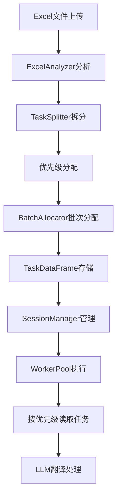
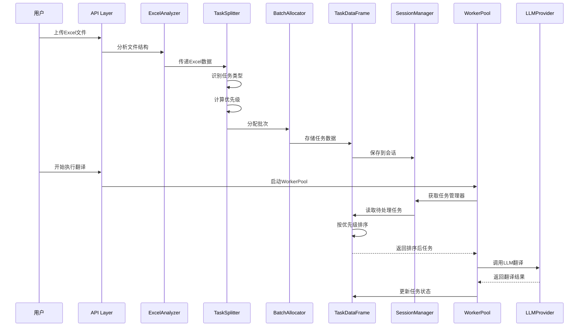

# Backend V2 任务拆分方案文档

## 📋 目录

- [一、整体架构](#一整体架构)
- [二、任务拆分流程](#二任务拆分流程)
- [三、优先级系统](#三优先级系统)
- [四、批次分配策略](#四批次分配策略)
- [五、任务类型识别](#五任务类型识别)
- [六、数据流设计](#六数据流设计)
- [七、配置参数说明](#七配置参数说明)
- [八、性能优化策略](#八性能优化策略)

## 一、整体架构

### 🏗️ 系统架构图



### 📁 核心文件结构

```
services/
├── excel_analyzer.py      # Excel文件分析
├── task_splitter.py       # 任务拆分核心逻辑
├── batch_allocator.py     # 批次分配器
└── executor/
    └── worker_pool.py     # 任务执行器

models/
├── excel_dataframe.py     # Excel数据模型
├── task_dataframe.py      # 任务数据模型
└── game_info.py          # 游戏信息模型
```

## 二、任务拆分流程

### 🔄 完整拆分流程

```python
# services/task_splitter.py
class TaskSplitter:
    """任务拆分器 - 将Excel数据转换为翻译任务"""

    def split_tasks(self, excel_df: ExcelDataFrame, game_info: GameInfo = None):
        """
        主要拆分步骤：
        1. 遍历所有Sheet和单元格
        2. 识别需要翻译的内容
        3. 确定任务类型（normal/yellow/blue）
        4. 计算任务优先级
        5. 生成任务ID和批次ID
        6. 创建结构化任务数据
        """
```

### 📊 任务数据结构

```python
task_data = {
    # 基础标识
    'task_id': 'task_20240129_123456_0001',      # 唯一任务ID
    'batch_id': 'batch_Sheet1_CH_PT_001',        # 批次ID
    'group_id': 'group_Sheet1_CH_PT',            # 分组ID

    # 源数据信息
    'sheet_name': 'Sheet1',                      # Sheet名称
    'row_index': 2,                               # 行索引
    'column_name': 'Text_PT',                    # 列名
    'cell_address': 'C3',                        # 单元格地址

    # 翻译内容
    'source_text': '欢迎来到游戏世界',            # 源文本
    'source_lang': 'CH',                         # 源语言
    'target_lang': 'PT',                         # 目标语言
    'source_context': '[UI Text] Menu Screen',   # 上下文

    # 任务属性
    'task_type': 'normal',                       # normal/yellow/blue
    'priority': 5,                                # 优先级(1-10)
    'char_count': 8,                             # 字符数
    'status': 'pending',                         # 任务状态

    # 元数据
    'created_at': datetime.now(),                # 创建时间
    'updated_at': datetime.now(),                # 更新时间
    'retry_count': 0,                            # 重试次数
    'is_final': False                            # 是否最终版本
}
```

## 三、优先级系统

### 🎯 优先级分配规则

```python
# services/task_splitter.py:388-418
def _determine_priority(self, sheet_name: str, source_text: str, task_type: str) -> int:
    """
    优先级分配规则 (1-10, 数字越大优先级越高)
    """
    # 基础优先级按任务类型
    if task_type == 'yellow':
        base_priority = 9  # 黄色重译 - 最高优先级
    elif task_type == 'blue':
        base_priority = 7  # 蓝色缩短 - 高优先级
    else:  # normal
        base_priority = 5  # 普通翻译 - 标准优先级

    # 额外优先级加分
    if 'ui' in sheet_name.lower():
        base_priority = min(10, base_priority + 1)  # UI文本 +1
    elif task_type == 'normal' and len(source_text) <= 20:
        base_priority = min(10, base_priority + 1)  # 短文本 +1

    return base_priority
```

### 📊 优先级分布表

| 任务类型 | 颜色标识 | 基础优先级 | UI加分 | 短文本加分 | 最终范围 | 执行顺序 |
|---------|---------|-----------|--------|-----------|---------|---------|
| **重译任务** | 🟨 黄色 | 9 | +1 | - | 9-10 | 第1优先 |
| **缩短任务** | 🔵 蓝色 | 7 | +1 | - | 7-8 | 第2优先 |
| **普通任务** | ⚪ 无色 | 5 | +1 | +1 | 5-6 | 第3优先 |

### 🔄 优先级使用机制

```python
# models/task_dataframe.py:131-146
def get_pending_tasks(self, limit: int = None) -> pd.DataFrame:
    """获取待处理任务，按优先级降序排序"""
    pending = self.df[self.df['status'] == TaskStatus.PENDING]

    # 按优先级降序 + task_id升序（稳定排序）
    pending = pending.sort_values(
        by=['priority', 'task_id'],
        ascending=[False, True]  # 高优先级先执行
    )

    return pending.head(limit) if limit else pending
```

## 四、批次分配策略

### 📦 批次分配器

```python
# services/batch_allocator.py
class BatchAllocator:
    def __init__(self):
        # 从配置读取控制参数
        self.max_chars_per_batch = config_manager.max_chars_per_batch  # 1000字符

    def allocate_batches(self, tasks: List[Dict], target_lang: str) -> Dict[str, List[Dict]]:
        """
        批次分配策略：
        1. 按目标语言分组
        2. 按字符数限制分批
        3. 保持上下文连续性
        4. 生成唯一批次ID
        """
```

### 🔢 批次ID生成规则

```python
def generate_batch_id(sheet_name: str, source_lang: str, target_lang: str, index: int) -> str:
    """
    批次ID格式: batch_{sheet}_{source}_{target}_{序号}
    示例: batch_Sheet1_CH_PT_001
    """
    return f"batch_{sheet_name}_{source_lang}_{target_lang}_{index:03d}"
```

### 📊 批次分配示例

```yaml
输入任务列表 (10个任务，每个100字符):
  - Task1: priority=10, chars=100
  - Task2: priority=9,  chars=100
  - Task3: priority=9,  chars=100
  - ...
  - Task10: priority=5, chars=100

配置参数:
  max_chars_per_batch: 1000  # 每批次最大1000字符

输出批次:
  Batch1: [Task1-10 按优先级排序] # 1000字符
  执行顺序: 高优先级任务在批次内优先处理
```

## 五、任务类型识别

### 🏷️ 任务类型定义

```python
# 任务类型枚举
TASK_TYPES = {
    'normal': '普通翻译任务',   # 新翻译或空白填充
    'yellow': '黄色重译任务',   # 需要重新翻译
    'blue':   '蓝色缩短任务'    # 需要缩短长度
}
```

### 🎨 颜色识别逻辑

```python
# utils/color_detector.py
class ColorDetector:
    @staticmethod
    def detect_cell_color(fill_color) -> str:
        """检测单元格背景颜色"""
        if not fill_color or fill_color == 'FFFFFF':
            return 'no_color'

        # 颜色阈值判断
        r, g, b = ColorDetector._hex_to_rgb(fill_color)

        if r > 200 and g > 200 and b < 100:  # 黄色系
            return 'yellow'
        elif r < 100 and g < 150 and b > 200:  # 蓝色系
            return 'blue'
        else:
            return 'no_color'
```

### 📝 任务类型应用

```python
def create_task(source_text, target_lang, cell_color):
    """根据单元格颜色确定任务类型"""

    # 颜色 → 任务类型映射
    task_type_map = {
        'yellow': 'yellow',  # 黄色 → 重译
        'blue': 'blue',      # 蓝色 → 缩短
        'no_color': 'normal' # 无色 → 普通
    }

    task_type = task_type_map.get(cell_color, 'normal')
    priority = _determine_priority(sheet_name, source_text, task_type)

    return {
        'task_type': task_type,
        'priority': priority,
        # ... 其他字段
    }
```

## 六、数据流设计

### 🔄 完整数据流



### 📊 任务状态流转

```python
class TaskStatus:
    PENDING = 'pending'        # 待处理
    PROCESSING = 'processing'  # 处理中
    COMPLETED = 'completed'    # 已完成
    FAILED = 'failed'         # 失败
    SKIPPED = 'skipped'       # 跳过
```

## 七、配置参数说明

### ⚙️ 任务拆分配置

```yaml
# config/config.yaml

# 任务执行控制
task_execution:
  batch_control:
    max_chars_per_batch: 1000      # 每批次最大字符数
    max_concurrent_workers: 10     # 最大并发Worker数

  # 预留的拆分控制参数
  split_control:
    max_task_chars: 500           # 单个任务最大字符数(未使用)
    context_overlap: 50           # 上下文重叠字符数(未使用)
    min_batch_size: 1             # 最小批次大小(未使用)

# LLM配置（独立于任务拆分）
llm:
  providers:
    qwen-plus:
      max_tokens: 8000            # LLM输出token限制(远大于批次限制)
```

### 📋 参数使用位置

| 参数名 | 默认值 | 使用位置 | 说明 |
|-------|--------|---------|------|
| `max_chars_per_batch` | 1000 | `BatchAllocator` | 控制批次大小 |
| `max_concurrent_workers` | 10 | `WorkerPool` | 并发执行数 |
| `max_tokens` | 8000 | `LLMProvider` | LLM API限制 |

## 八、性能优化策略

### ⚡ 优化策略

#### 1. 优先级优化
- 重要任务（黄色/蓝色）优先处理
- UI文本获得额外优先级
- 避免长文本阻塞短文本

#### 2. 批次优化
- 合理控制批次大小（1000字符）
- 相似任务聚合处理
- 减少LLM调用次数

#### 3. 并发优化
- 多Worker并行处理
- 批次间负载均衡
- 避免单点瓶颈

### 📊 性能指标

```python
# 典型性能数据
性能指标 = {
    '单批次处理时间': '2-5秒',
    '并发Worker数': 10,
    '每秒处理任务数': '20-50个',
    '批次大小': '1000字符',
    'LLM调用效率': '批量优化减少80%调用'
}
```

### 🔧 调优建议

1. **批次大小调整**
   - 小文本多：降低 `max_chars_per_batch` 到 500
   - 长文本多：提高到 2000-5000

2. **优先级调整**
   - UI密集型：提高UI文本优先级权重
   - 批量处理：降低优先级差异，提高吞吐量

3. **并发数调整**
   - API限制严格：降低 `max_concurrent_workers`
   - 资源充足：提高到 15-20

## 九、实际案例

### 📝 案例：游戏UI翻译

```python
# 输入Excel结构
Sheet: UI_Texts
Columns: [ID, Text_CH, Text_EN, Text_PT, Text_TH]
Rows: 1000行UI文本

# 拆分结果
总任务数: 3000 (1000行 × 3种目标语言)
批次数: 300 (按1000字符/批次)
优先级分布:
  - Priority 10: 50个 (黄色UI文本)
  - Priority 9: 100个 (黄色普通文本)
  - Priority 6: 500个 (普通UI文本)
  - Priority 5: 2350个 (普通长文本)

# 执行顺序
1. 先处理所有Priority 10任务
2. 再处理Priority 9任务
3. 依次处理剩余任务
```

## 十、故障处理

### ❌ 常见问题

1. **任务丢失**
   - 原因：Session超时
   - 解决：增加session_timeout配置

2. **优先级失效**
   - 原因：DataFrame排序问题
   - 解决：检查sort_values参数

3. **批次过大**
   - 原因：长文本未分割
   - 解决：实现文本分割逻辑

### 🔧 调试工具

```python
# 查看任务分布
python -c "
from utils.session_manager import session_manager
task_manager = session_manager.get_task_manager('session_id')
print(task_manager.get_statistics())
"

# 检查优先级排序
df = task_manager.get_pending_tasks()
print(df[['task_id', 'priority', 'task_type']].head(20))
```

---

**文档版本**: v1.0
**最后更新**: 2024-01-29
**作者**: Backend V2 Team

本文档详细描述了Backend V2翻译系统的任务拆分方案，包括优先级系统、批次分配、任务类型识别等核心机制。