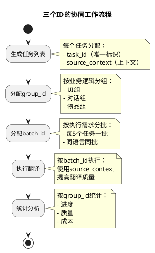

# 任务分组策略说明 - batch_id、group_id、source_context详解

## 一、batch_id（批次ID）

### 1.1 定义和用途
**batch_id** 是用于LLM批量调用的最小执行单元标识。

```
用途：将多个任务合并为一次LLM请求，提高效率和降低成本
格式：BATCH_{语言}_{序号}，如 BATCH_PT_001
粒度：通常5个任务组成1个批次
```

### 1.2 分配逻辑

```python
# batch_id 分配示例
def assign_batch_id(tasks_df):
    """
    按目标语言分组，每5个任务一批
    """
    batch_size = 5

    # 按目标语言分组
    for lang in ['PT', 'TH', 'VN']:
        lang_tasks = tasks_df[tasks_df['target_lang'] == lang]

        # 每5个任务分配一个batch_id
        for i in range(0, len(lang_tasks), batch_size):
            batch_id = f"BATCH_{lang}_{i//batch_size:03d}"
            tasks_df.loc[lang_tasks.index[i:i+batch_size], 'batch_id'] = batch_id
```

### 1.3 批次执行示例

```yaml
批次执行流程:
  BATCH_PT_001:
    任务: [TASK_001, TASK_002, TASK_003, TASK_004, TASK_005]
    目标语言: PT
    执行方式: 合并为一个LLM请求

  LLM请求格式:
    prompt: |
      请翻译以下5个文本到葡萄牙语：
      1. 开始游戏
      2. 设置
      3. 退出
      4. 背包
      5. 商店

    响应: |
      1. Iniciar Jogo
      2. Configurações
      3. Sair
      4. Mochila
      5. Loja
```

### 1.4 batch_id的优势

| 特性 | 说明 |
|------|------|
| **减少API调用** | 5个任务 = 1次调用，节省80%请求次数 |
| **提高吞吐量** | 批量处理，降低网络开销 |
| **成本优化** | 减少Token重复（如系统提示词） |
| **便于重试** | 整批失败可以整批重试 |

## 二、group_id（分组ID）

### 2.1 定义和用途
**group_id** 是更高层级的任务组织单位，用于业务逻辑分组。

```
用途：将相关任务组织在一起，便于管理和追踪
格式：GROUP_{类型}_{序号}，如 GROUP_UI_001
粒度：可包含多个批次
```

### 2.2 分组策略

```python
# group_id 分组策略
def assign_group_id(tasks_df):
    """
    按业务逻辑分组，如：
    - 按Excel Sheet分组
    - 按内容类型分组（UI文本、对话、物品描述等）
    - 按优先级分组
    """

    # 策略1：按Sheet分组
    for sheet_name in tasks_df['sheet_name'].unique():
        sheet_tasks = tasks_df[tasks_df['sheet_name'] == sheet_name]
        group_id = f"GROUP_{sheet_name}_001"
        tasks_df.loc[sheet_tasks.index, 'group_id'] = group_id

    # 策略2：按内容类型分组（通过关键词识别）
    ui_keywords = ['按钮', '菜单', '界面', 'UI']
    dialog_keywords = ['对话', '台词', 'NPC']

    for idx, task in tasks_df.iterrows():
        source_text = task['source_text']

        if any(keyword in source_text for keyword in ui_keywords):
            tasks_df.loc[idx, 'group_id'] = 'GROUP_UI_001'
        elif any(keyword in source_text for keyword in dialog_keywords):
            tasks_df.loc[idx, 'group_id'] = 'GROUP_DIALOG_001'
        else:
            tasks_df.loc[idx, 'group_id'] = 'GROUP_GENERAL_001'
```

### 2.3 group_id的应用场景

```yaml
应用场景:
  进度追踪:
    - 查看UI文本翻译进度: WHERE group_id = 'GROUP_UI_001'
    - 查看Sheet1完成情况: WHERE group_id = 'GROUP_Sheet1_001'

  优先级控制:
    - 优先翻译核心组: GROUP_CORE_*
    - 延后翻译扩展组: GROUP_EXTRA_*

  质量控制:
    - 对话组需要人工复审: GROUP_DIALOG_* → needs_review = true
    - UI组需要长度限制: GROUP_UI_* → max_length = 20

  成本分配:
    - 按组统计Token使用: GROUP BY group_id
    - 按组计算成本: SUM(token_count) GROUP BY group_id
```

### 2.4 batch_id vs group_id

| 维度 | batch_id | group_id |
|------|----------|----------|
| **粒度** | 5个任务（执行单元） | N个批次（业务单元） |
| **用途** | LLM调用优化 | 业务管理 |
| **分组依据** | 目标语言 + 数量 | 业务逻辑 |
| **生命周期** | 执行时使用 | 全流程使用 |
| **示例** | BATCH_PT_001 | GROUP_UI_001 |

## 三、source_context（源文本上下文）

### 3.1 定义和用途
**source_context** 提供额外的背景信息，帮助LLM更准确地翻译。

```
用途：提供游戏背景、使用场景、相关信息等上下文
格式：自由文本，可包含多种信息
来源：注释、相邻单元格、预定义规则
```

### 3.2 上下文类型

```python
# source_context 的不同类型
class ContextTypes:
    """上下文信息类型"""

    # 1. 游戏场景上下文
    GAME_CONTEXT = {
        "场景": "主菜单界面",
        "类型": "按钮文本",
        "限制": "最多10个字符"
    }

    # 2. 角色对话上下文
    DIALOG_CONTEXT = {
        "说话者": "商人NPC",
        "情绪": "友好",
        "场合": "首次见面"
    }

    # 3. 物品描述上下文
    ITEM_CONTEXT = {
        "物品类型": "武器",
        "稀有度": "传说",
        "使用要求": "等级50"
    }

    # 4. 技术限制上下文
    TECHNICAL_CONTEXT = {
        "最大长度": 20,
        "允许字符": "仅字母数字",
        "大小写": "首字母大写"
    }
```

### 3.3 上下文生成策略

```python
def generate_source_context(task_row, excel_df):
    """
    生成源文本的上下文信息
    """
    context_parts = []

    # 1. 从Excel注释获取
    if task_row['comment']:
        context_parts.append(f"注释: {task_row['comment']}")

    # 2. 从相邻单元格获取（上下文推断）
    row_idx = task_row['row_idx']
    if row_idx > 0:
        # 查看上一行是否是类别标题
        prev_row = excel_df.iloc[row_idx - 1]
        if is_category_header(prev_row):
            context_parts.append(f"类别: {prev_row[0]}")

    # 3. 从列标题获取
    col_header = excel_df.columns[task_row['col_idx']]
    if col_header:
        context_parts.append(f"列类型: {col_header}")

    # 4. 从文本特征推断
    source_text = task_row['source_text']
    if len(source_text) <= 10:
        context_parts.append("UI元素（短文本）")
    elif "。" in source_text or "，" in source_text:
        context_parts.append("完整句子")

    # 5. 从预定义规则获取
    if task_row['sheet_name'] == 'UI_Texts':
        context_parts.append("用户界面文本，需要简洁")
    elif task_row['sheet_name'] == 'Dialogs':
        context_parts.append("游戏对话，保持角色语气")

    return " | ".join(context_parts)
```

### 3.4 上下文在LLM提示词中的应用

```python
def build_llm_prompt_with_context(task):
    """
    构建包含上下文的LLM提示词
    """
    prompt = f"""
    任务：将以下{task['source_lang']}文本翻译为{task['target_lang']}

    源文本：{task['source_text']}

    上下文信息：{task['source_context']}

    翻译要求：
    1. 根据上下文选择合适的翻译风格
    2. 如果是UI文本，保持简洁
    3. 如果是对话，保持角色特征
    4. 遵守长度限制（如有）

    请提供翻译：
    """
    return prompt
```

### 3.5 上下文的实际例子

```yaml
示例1 - UI按钮:
  source_text: "Start"
  source_context: "主菜单界面 | UI元素（短文本） | 最多10个字符"
  翻译结果: "开始" （而不是"开始游戏"）

示例2 - NPC对话:
  source_text: "Welcome, traveler!"
  source_context: "说话者：旅店老板 | 场合：首次进店 | 友好语气"
  翻译结果: "欢迎光临，旅行者！" （保持友好语气）

示例3 - 物品名称:
  source_text: "Sword"
  source_context: "物品类型：武器 | 稀有度：普通 | 列表项"
  翻译结果: "剑" （简洁的物品名）

示例4 - 技能描述:
  source_text: "Deals damage to all enemies"
  source_context: "技能描述 | 战斗系统 | 需要准确描述效果"
  翻译结果: "对所有敌人造成伤害" （准确完整）
```

## 四、三者的协同工作

### 4.1 在任务DataFrame中的关系

```python
# 任务DataFrame示例
task_df = pd.DataFrame({
    'task_id': 'TASK_001',
    'batch_id': 'BATCH_PT_001',      # 执行批次
    'group_id': 'GROUP_UI_001',       # 业务分组
    'source_text': 'Start',
    'source_context': '主菜单按钮 | 最多10字符',  # 上下文信息
    'target_lang': 'PT',
    # ... 其他字段
})
```

### 4.2 执行流程中的应用



### 4.3 查询示例

```sql
-- 查看UI组的葡萄牙语翻译进度
SELECT
    group_id,
    COUNT(*) as total,
    SUM(CASE WHEN status = 'completed' THEN 1 ELSE 0 END) as completed,
    AVG(confidence) as avg_confidence
FROM task_df
WHERE group_id = 'GROUP_UI_001'
    AND target_lang = 'PT'
GROUP BY group_id;

-- 查看批次执行情况
SELECT
    batch_id,
    COUNT(*) as task_count,
    MIN(start_time) as batch_start,
    MAX(end_time) as batch_end,
    AVG(duration_ms) as avg_duration
FROM task_df
WHERE batch_id LIKE 'BATCH_PT_%'
GROUP BY batch_id
ORDER BY batch_id;

-- 查看需要特殊处理的任务（根据上下文）
SELECT
    task_id,
    source_text,
    source_context,
    result
FROM task_df
WHERE source_context LIKE '%最多10字符%'
    AND LENGTH(result) > 10;
```

## 五、设计优势总结

### 5.1 分层管理的优势

| 层级 | 作用 | 优势 |
|------|------|------|
| **task_id** | 原子操作单位 | 精确追踪每个翻译 |
| **batch_id** | 执行优化单位 | 提高API效率 |
| **group_id** | 业务管理单位 | 灵活的业务控制 |
| **source_context** | 质量保障 | 提高翻译准确性 |

### 5.2 实际收益

1. **性能提升**：通过batch_id批量执行，减少80%的API调用
2. **质量提升**：通过source_context提供背景，提高翻译准确性
3. **管理便利**：通过group_id分组管理，清晰追踪各模块进度
4. **成本优化**：批量处理减少Token重复，降低API成本
5. **灵活调度**：可以按group优先级调度，按batch并发执行