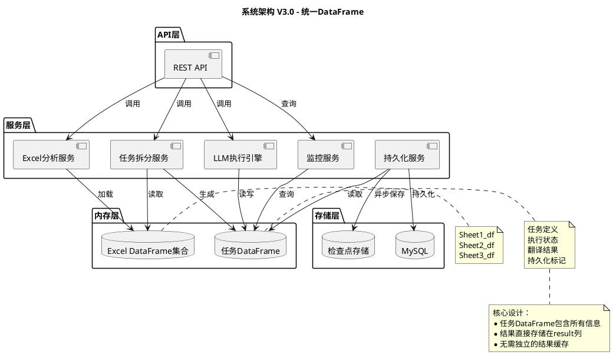
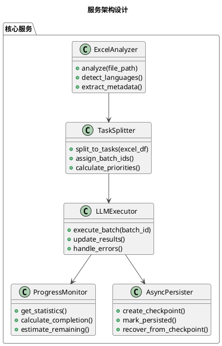
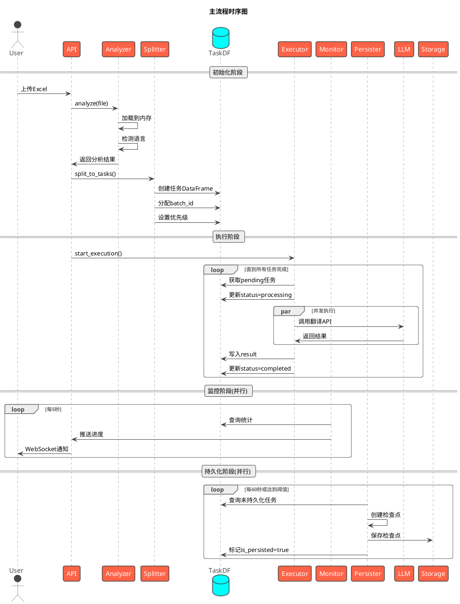
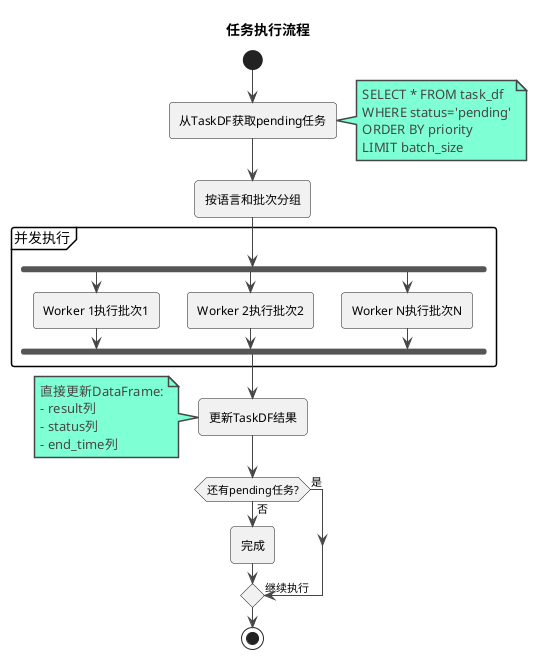
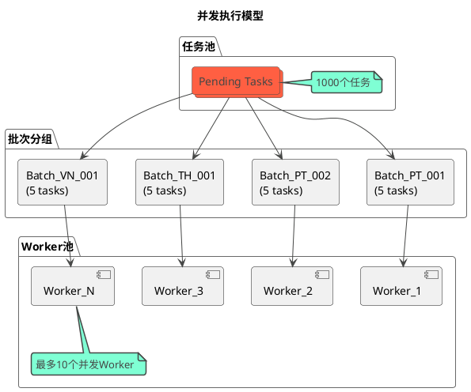
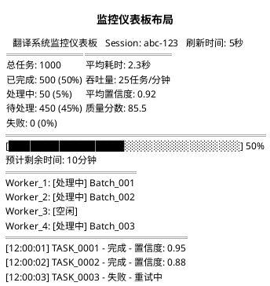
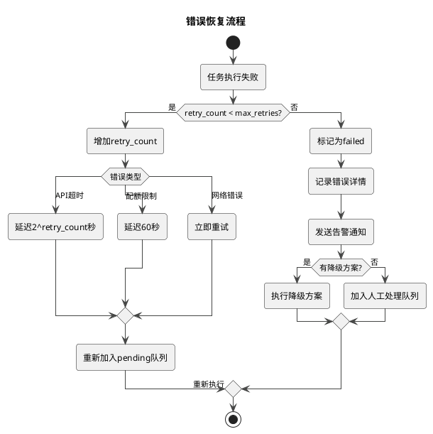
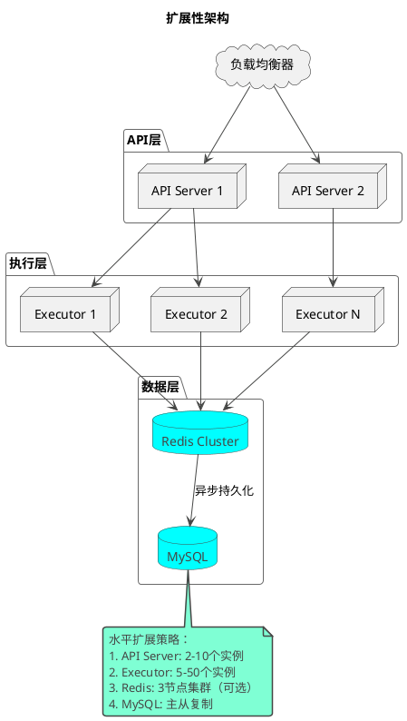

# 翻译系统设计方案 V3.0 - 统一DataFrame架构

## 一、系统架构概览

### 1.1 核心设计理念

- **单一数据源**：任务DataFrame作为唯一真实数据源，包含任务定义、状态和结果
- **全内存操作**：Excel分析、任务拆分、执行、回写全在内存中进行
- **异步持久化**：定期保存检查点，不阻塞主流程
- **无缓存设计**：结果直接写入任务DataFrame，无需独立缓存

### 1.2 系统架构图



## 二、配置文件设计

### 2.1 系统配置文件

```yaml
# config.yaml - 系统配置文件
llm:
  # 模型限制
  model_limits:
    input_tokens: 98304          # 单次输入Token限制
    output_tokens: 16384         # 单次输出Token限制
    rpm_limit: 15000            # 每分钟请求数限制
    tpm_limit: 1200000          # 每分钟Token数限制

  # 批次控制（核心配置）
  batch_control:
    max_chars_per_batch: 50000  # 单次LLM最大读取字符数（可调）
    max_concurrent_workers: 10   # LLM最大并发数（可调）
    min_batch_size: 1           # 最小批次大小
    max_batch_size: 100         # 最大批次大小

  # 性能优化
  performance:
    rpm_throttle: 14000         # 实际RPM限制（留10%余量）
    tpm_throttle: 1100000       # 实际TPM限制（留10%余量）
    retry_delay: 5              # 重试延迟（秒）
    max_retries: 3              # 最大重试次数
    timeout: 30                 # 单次请求超时（秒）

# 系统设置
system:
  checkpoint_interval: 60       # 检查点保存间隔（秒）
  monitoring_interval: 5        # 监控刷新间隔（秒）
  max_memory_usage: 4096       # 最大内存使用（MB）
  log_level: INFO              # 日志级别

# 数据处理
data_processing:
  # 字符计算规则
  char_counting:
    include_context: true       # 是否包含上下文
    char_weight: 1.5           # 字符到Token的估算系数

  # 单元格处理
  cell_processing:
    max_cell_chars: 10000      # 单个单元格最大字符数
    split_large_cells: false   # 是否拆分超大单元格
```

### 2.2 动态调整机制

| 调整策略 | 触发条件 | 调整动作 | 目标效果 |
|---------|---------|---------|---------|
| **批次大小调整** | 错误率 > 10% | 减小max_chars_per_batch 20% | 降低错误率 |
| **并发数增加** | 平均耗时 > 5秒 | 增加2个Worker（上限20） | 提高处理速度 |
| **并发数减少** | 接近RPM限制 | 减少1个Worker | 避免限流 |
| **字符数优化** | Token使用率 < 50% | 增加批次字符数 | 提高效率 |
| **自动降级** | 连续失败3次 | 切换备用模型 | 保证可用性 |

## 三、DataFrame结构设计

### 3.1 任务DataFrame结构

| 列名 | 类型 | 说明 | 索引 |
|------|------|------|------|
| **task_id** | str | 任务唯一标识 TASK_0001 | Primary Key |
| **batch_id** | str | 执行批次ID（LLM调用单元） | Index |
| **group_id** | str | 业务分组ID（管理单元） | Index |
| | | | |
| **源文本信息** | | | |
| source_lang | category | 源语言 CH/EN | |
| source_text | str | 源文本内容 | |
| source_context | str | 上下文信息 | |
| game_context | str | 游戏背景信息 | |
| | | | |
| **目标信息** | | | |
| target_lang | category | 目标语言 PT/TH/VN | Index |
| target_region | str | 目标地区 BR/TH/VN | |
| | | | |
| **位置信息** | | | |
| excel_id | str | Excel文件ID | Index |
| sheet_name | str | Sheet名称 | |
| row_idx | int32 | 行索引(0-based) | |
| col_idx | int32 | 列索引(0-based) | |
| cell_ref | str | Excel坐标 A1/B2 | |
| | | | |
| **执行状态** | | | |
| status | category | pending/processing/completed/failed | Index |
| priority | int8 | 优先级 1-10 | Index |
| worker_id | str | 执行Worker ID | |
| start_time | datetime64[ns] | 开始时间 | |
| end_time | datetime64[ns] | 结束时间 | |
| duration_ms | int32 | 执行耗时(毫秒) | |
| | | | |
| **翻译结果** | | | |
| result | str | 翻译结果文本 | |
| confidence | float32 | 置信度 0-1 | |
| quality_score | float32 | 质量分数 0-100 | |
| token_count | int32 | Token使用量 | |
| model_name | str | 使用的模型 | |
| | | | |
| **错误处理** | | | |
| retry_count | int8 | 重试次数 | |
| error_msg | str | 错误信息 | |
| error_type | category | 错误类型 | |
| | | | |
| **持久化** | | | |
| is_persisted | bool | 是否已持久化 | Index |
| checkpoint_id | str | 检查点ID | |
| persist_time | datetime64[ns] | 持久化时间 | |

### 3.2 任务分组策略设计

#### 3.2.1 三层任务组织结构

| 层级 | 标识 | 粒度 | 用途 | 示例 |
|------|------|------|------|------|
| **任务级** | task_id | 1个单元格 | 最小执行单位 | TASK_0001 |
| **批次级** | batch_id | N个任务（按字符数） | LLM调用优化 | BATCH_PT_001 |
| **分组级** | group_id | M个批次（按业务） | 业务管理 | GROUP_UI_001 |

#### 3.2.2 batch_id设计

**定义**：用于LLM批量调用的执行单元标识

| 属性 | 说明 |
|------|------|
| **格式** | BATCH_{语言}_{序号} |
| **分配原则** | 基于字符数累积，非固定任务数 |
| **典型规模** | 1-100个任务，总字符数≤50000 |
| **优势** | 减少API调用次数80%，提高吞吐量 |

**批次分配策略**：
- 同目标语言任务分到同批
- 按字符数累积，不超过max_chars_per_batch
- 保证单元格完整性（不截断）

#### 3.2.3 group_id设计

**定义**：业务逻辑分组，用于管理和追踪

| 分组类型 | group_id格式 | 用途 |
|---------|-------------|------|
| **按Sheet** | GROUP_Sheet1_001 | Sheet级别进度追踪 |
| **按内容** | GROUP_UI_001 | UI文本统一管理 |
| **按优先级** | GROUP_CORE_001 | 核心内容优先处理 |
| **按场景** | GROUP_DIALOG_001 | 对话文本特殊处理 |

**应用场景**：
- 进度查询：统计特定组的完成率
- 质量控制：对话组需要人工复审
- 成本分配：按组计算Token使用量
- 批量操作：暂停/恢复特定组

#### 3.2.4 source_context设计

**定义**：提供翻译上下文，提高翻译质量

| 上下文类型 | 内容示例 | 作用 |
|-----------|---------|------|
| **游戏场景** | "主菜单界面\|按钮文本" | 确定翻译风格 |
| **技术限制** | "最多10字符\|UI元素" | 控制翻译长度 |
| **角色信息** | "商人NPC\|友好语气" | 保持角色特征 |
| **物品属性** | "武器\|传说级\|剑" | 准确翻译术语 |

**上下文来源**：
1. Excel注释提取
2. 相邻单元格推断
3. 列标题信息
4. 预定义规则库
5. 文本特征分析

### 3.3 Excel DataFrame结构

```yaml
Excel DataFrame集合:
  Sheet1:
    columns: [CH, EN, PT, TH, VN, ...]
    index: RangeIndex(0, n)
    dtype: object (所有列为字符串)

  Sheet2:
    columns: [源语言列, 目标语言列, ...]
    index: RangeIndex(0, m)

  元数据:
    color_map: Dict[(row, col), color_code]
    comment_map: Dict[(row, col), comment_text]
    merged_cells: List[CellRange]
```

## 三、核心服务设计

### 3.1 服务架构



### 3.2 服务职责

| 服务名称 | 职责 | 输入 | 输出 |
|---------|------|------|------|
| **ExcelAnalyzer** | 分析Excel文件结构 | Excel文件路径 | 分析报告、DataFrame |
| **TaskSplitter** | 生成任务DataFrame | Excel DataFrame | 任务DataFrame |
| **LLMExecutor** | 执行翻译任务 | 任务DataFrame | 更新结果到DataFrame |
| **ProgressMonitor** | 监控执行进度 | 任务DataFrame | 统计信息、进度报告 |
| **AsyncPersister** | 异步持久化 | 任务DataFrame | 检查点文件 |

## 四、执行流程设计

### 4.1 主流程时序图



### 4.2 任务执行流程



## 五、API设计

### 5.1 RESTful API

| 端点 | 方法 | 功能 | 请求体 | 响应 |
|------|------|------|--------|------|
| `/api/v3/upload` | POST | 上传Excel | multipart/form-data | {session_id, analysis} |
| `/api/v3/translate` | POST | 开始翻译 | {session_id, options} | {task_count, estimated_time} |
| `/api/v3/status/{session_id}` | GET | 获取状态 | - | {progress, statistics} |
| `/api/v3/tasks/{session_id}` | GET | 获取任务列表 | - | {tasks: DataFrame} |
| `/api/v3/results/{session_id}` | GET | 获取结果 | - | {results: DataFrame} |
| `/api/v3/export/{session_id}` | GET | 导出结果 | - | Excel文件 |
| `/api/v3/checkpoint/{session_id}` | GET | 获取检查点 | - | {checkpoints: list} |

### 5.2 监控API轮询

```yaml
监控方式: HTTP轮询（无WebSocket）

轮询接口:
  GET /api/monitor/status/{session_id}
    - 客户端每5秒轮询一次
    - 返回最新进度信息

  GET /api/monitor/dataframe/{session_id}
    - 获取最新DataFrame内容
    - 支持status过滤
    - 支持分页
```

## 六、数据库设计

### 6.1 MySQL表结构

```sql
-- 会话表
CREATE TABLE translation_sessions (
    session_id VARCHAR(36) PRIMARY KEY,
    excel_filename VARCHAR(255),
    created_at TIMESTAMP DEFAULT CURRENT_TIMESTAMP,
    updated_at TIMESTAMP DEFAULT CURRENT_TIMESTAMP ON UPDATE CURRENT_TIMESTAMP,
    status VARCHAR(20), -- uploading/analyzing/translating/completed
    total_tasks INT,
    completed_tasks INT,
    metadata JSON,
    INDEX idx_status (status),
    INDEX idx_created (created_at)
);

-- 任务表（持久化存储）
CREATE TABLE translation_tasks (
    task_id VARCHAR(20) PRIMARY KEY,
    session_id VARCHAR(36),
    batch_id VARCHAR(20),
    source_lang VARCHAR(10),
    source_text TEXT,
    target_lang VARCHAR(10),
    result TEXT,
    status VARCHAR(20),
    confidence FLOAT,
    created_at TIMESTAMP DEFAULT CURRENT_TIMESTAMP,
    completed_at TIMESTAMP NULL,
    INDEX idx_session (session_id),
    INDEX idx_status (status),
    INDEX idx_batch (batch_id)
);

-- 检查点表
CREATE TABLE translation_checkpoints (
    checkpoint_id VARCHAR(30) PRIMARY KEY,
    session_id VARCHAR(36),
    created_at TIMESTAMP DEFAULT CURRENT_TIMESTAMP,
    task_count INT,
    file_path VARCHAR(500),
    metadata JSON,
    INDEX idx_session (session_id)
);
```

### 6.2 Redis缓存结构

```yaml
Redis Keys:
  # 会话信息
  session:{session_id}:
    type: hash
    fields: {status, total_tasks, completed_tasks, ...}
    ttl: 3600

  # 任务DataFrame（序列化）
  tasks:{session_id}:
    type: string (pickle序列化的DataFrame)
    ttl: 3600

  # 进度信息
  progress:{session_id}:
    type: hash
    fields: {completed, pending, processing, failed}
    ttl: 300

  # 实时统计
  stats:{session_id}:
    type: hash
    fields: {avg_duration, avg_confidence, throughput}
    ttl: 60

  # 锁（用于并发控制）
  lock:{session_id}:batch:{batch_id}:
    type: string
    value: worker_id
    ttl: 30
```

## 七、并发控制设计

### 7.1 并发模型



### 7.2 动态批次策略

#### 7.2.1 基于字符数的批次分配

```yaml
批次策略:
  核心原则:
    - 不按固定行数，而按字符数动态分配
    - 保证单元格完整性（不能读一半）
    - 根据模型限制自动调整

  配置参数:
    max_chars_per_batch: 50000      # 单次LLM最大字符数（可配置）
    max_concurrent_workers: 10       # LLM最大并发数（可配置）

  模型限制:
    input_tokens: 98304              # 单次输入Token限制
    output_tokens: 16384             # 单次输出Token限制
    rpm_limit: 15000                 # 每分钟请求数限制
    tpm_limit: 1200000              # 每分钟Token数限制
```

#### 7.2.2 动态批次算法设计

**核心算法逻辑：**

1. **按字符数分批**（非固定行数）
   - 累积字符数直到接近max_chars_per_batch
   - 保证单元格完整性（不截断）
   - 同目标语言任务在同批次

2. **批次分配流程**
   ```
   输入: 任务列表，每个任务字符数1-1000不等
   处理:
     1. 按目标语言分组（PT/TH/VN）
     2. 对每组按字符数累积
     3. 达到阈值时创建新批次
   输出: 批次ID分配，如BATCH_PT_001
   ```

3. **特殊情况处理**
   - 单个超大单元格（>50000字符）：独立成批
   - 极小单元格（<10字符）：尽量合并
   - 最后剩余任务：打包成最后一批

4. **批次示例**
   | 批次ID | 任务数 | 总字符数 | 说明 |
   |--------|--------|----------|------|
   | BATCH_PT_001 | 50 | 48000 | 多个小任务 |
   | BATCH_PT_002 | 1 | 45000 | 单个大任务 |
   | BATCH_PT_003 | 25 | 30000 | 混合任务 |

#### 7.2.3 并发控制参数

| 参数 | 默认值 | 说明 | 可调范围 |
|------|--------|------|---------|
| max_chars_per_batch | 50000 | 单批最大字符数 | 1000-98000 |
| max_concurrent_workers | 10 | 最大并发Worker | 1-50 |
| worker_timeout | 30s | Worker超时时间 | 10-120s |
| retry_delay | 5s | 重试延迟 | 1-30s |
| max_retries | 3 | 最大重试次数 | 1-5 |
| rpm_throttle | 14000 | RPM限制（留余量） | 1000-15000 |
| tpm_throttle | 1100000 | TPM限制（留余量） | 10000-1200000 |

## 八、监控指标设计

### 8.1 实时监控指标

```yaml
实时指标:
  任务指标:
    - total_tasks: 总任务数
    - completed_tasks: 已完成数
    - pending_tasks: 待处理数
    - processing_tasks: 处理中数
    - failed_tasks: 失败数
    - completion_rate: 完成率

  性能指标:
    - avg_duration_ms: 平均执行时间
    - p95_duration_ms: P95执行时间
    - throughput_per_min: 每分钟吞吐量
    - avg_confidence: 平均置信度
    - avg_quality_score: 平均质量分数

  资源指标:
    - active_workers: 活跃Worker数
    - memory_usage_mb: 内存使用量
    - cpu_usage_percent: CPU使用率
    - api_calls_count: API调用次数
    - token_usage_total: Token总使用量

  错误指标:
    - error_rate: 错误率
    - retry_rate: 重试率
    - timeout_count: 超时次数
```

### 8.2 监控仪表板



## 九、错误处理策略

### 9.1 错误分类与处理

| 错误类型 | 处理策略 | 重试策略 | 降级方案 |
|---------|---------|---------|---------|
| API超时 | 自动重试 | 指数退避 | 使用备用API |
| 模型错误 | 记录并重试 | 立即重试3次 | 切换模型 |
| 格式错误 | 标记review | 不重试 | 人工处理 |
| 配额限制 | 延迟执行 | 延迟60秒 | 降低并发 |
| 网络错误 | 自动重试 | 立即重试 | 本地缓存 |

### 9.2 错误恢复流程



## 十、性能优化策略

### 10.1 DataFrame优化

```yaml
优化策略:
  数据类型优化:
    - category类型: status, source_lang, target_lang
    - int8类型: priority, retry_count
    - int32类型: row_idx, col_idx, duration_ms
    - float32类型: confidence, quality_score

  索引优化:
    - 主键索引: task_id
    - 复合索引: [status, priority]
    - 批次索引: batch_id

  内存管理:
    - 及时释放完成的批次
    - 使用视图而非复制
    - 定期垃圾回收
```

### 10.2 执行优化

```yaml
执行优化:
  批处理策略:
    - 动态调整batch_size
    - 相同语言对任务分组
    - 优先级队列调度

  并发优化:
    - Worker池复用
    - 连接池管理
    - 异步I/O操作

  缓存策略:
    - 热点数据缓存
    - 结果预取
    - 检查点增量保存
```

## 十一、部署架构

### 11.1 容器化部署

```yaml
services:
  api-server:
    image: translation-api:v3
    replicas: 2
    resources:
      cpu: 2
      memory: 4Gi

  executor:
    image: translation-executor:v3
    replicas: 5
    resources:
      cpu: 1
      memory: 2Gi

  monitor:
    image: translation-monitor:v3
    replicas: 1
    resources:
      cpu: 0.5
      memory: 1Gi

  persister:
    image: translation-persister:v3
    replicas: 1
    resources:
      cpu: 0.5
      memory: 1Gi
```

### 11.2 扩展性设计



## 十二、总结

### 12.1 V3方案核心优势

1. **统一DataFrame架构**：任务表包含所有信息，无需独立缓存
2. **全内存操作**：高性能，低延迟
3. **异步持久化**：不影响主流程性能
4. **灵活扩展**：支持水平扩展
5. **完整监控**：实时进度，详细指标

### 12.2 关键设计决策

| 设计点 | 决策 | 理由 |
|--------|------|------|
| 数据结构 | 统一DataFrame | 查询强大，操作一致 |
| 结果存储 | 直接在任务表 | 避免数据同步问题 |
| 持久化 | 异步检查点 | 性能优先，可恢复 |
| 并发模型 | 批次+Worker池 | 平衡效率和资源 |
| 监控方式 | 实时+推送 | 及时发现问题 |