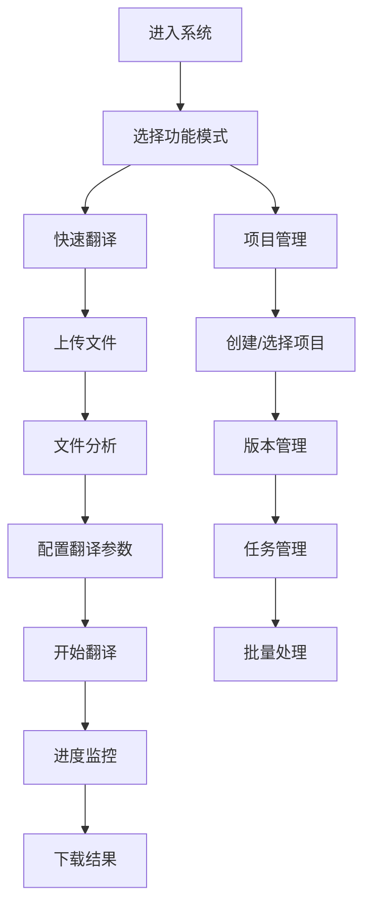
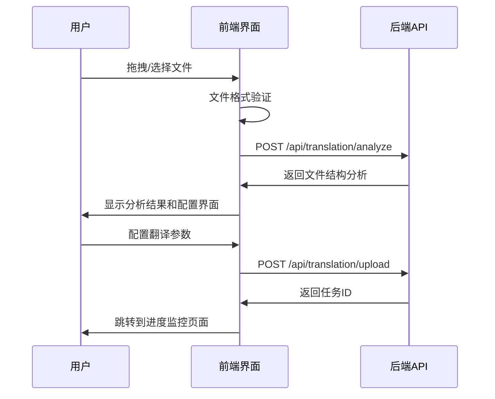
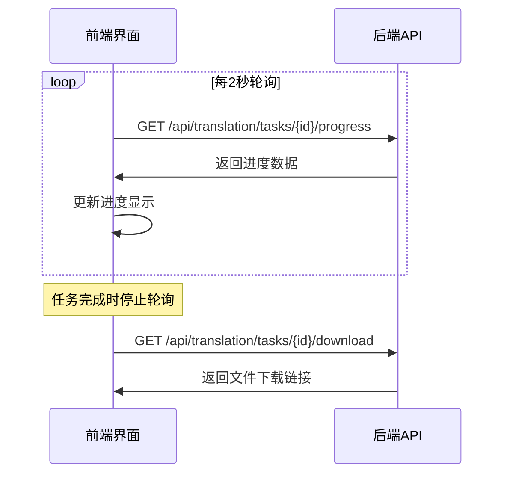
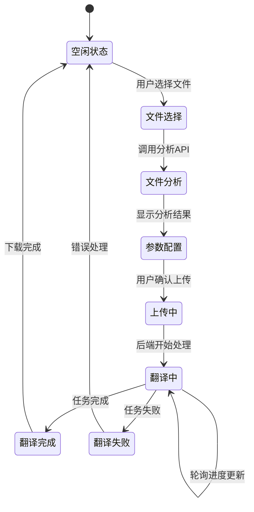
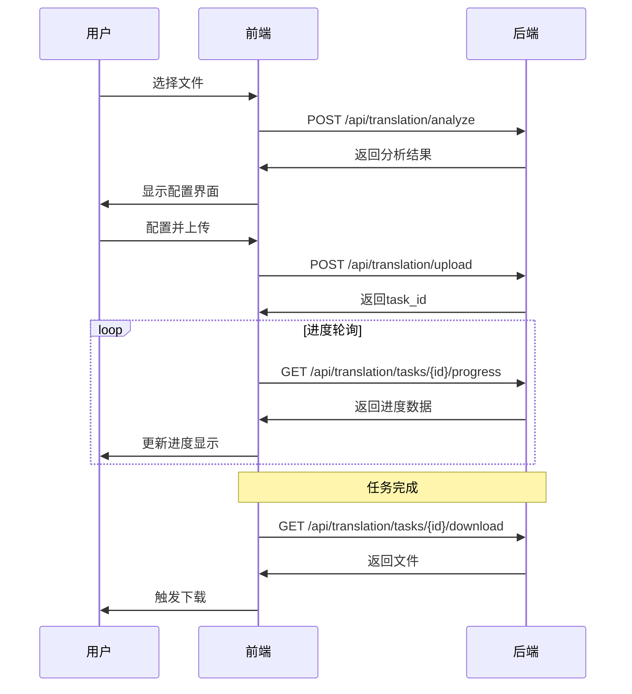

# 游戏本地化翻译系统 - 前端产品设计方案

## 📋 项目概述

### 产品定位
游戏本地化智能翻译系统的Web前端，为游戏开发团队提供高效、直观的Excel文件翻译服务。支持多语言批量翻译、实时进度跟踪、项目版本管理等功能。

### 核心价值
- **智能化**: 自动分析Excel结构，智能识别需要翻译的内容
- **高效性**: 支持多Sheet并发翻译，实时进度反馈
- **易用性**: 拖拽上传，可视化配置，一键下载
- **专业性**: 针对游戏本地化场景优化，支持术语管理和区域化配置

---

## 🎯 用户研究与需求分析

### 目标用户
1. **游戏本地化项目经理**: 需要管理多个翻译项目和版本
2. **本地化工程师**: 执行具体的翻译任务，关注效率和质量
3. **游戏开发者**: 偶尔需要翻译游戏文本，要求操作简单

### 用户痛点
- 传统翻译工具效率低，无法处理大批量文件
- 缺乏实时进度跟踪，无法估算完成时间
- 多语言翻译需要重复操作，容易出错
- 缺乏项目管理功能，版本控制困难

### 核心需求
| 需求类型 | 具体需求 | 优先级 |
|---------|---------|--------|
| 基础功能 | 文件上传、翻译、下载 | P0 |
| 进度跟踪 | 实时进度显示、预估时间 | P0 |
| 多语言支持 | 批量多语言翻译 | P0 |
| 文件分析 | Excel结构分析、预览 | P1 |
| 项目管理 | 项目创建、版本管理 | P1 |
| 系统监控 | 任务列表、状态管理 | P1 |

---

## 🎨 设计理念与原则

### 设计理念
- **任务导向**: 围绕翻译任务的完整生命周期设计
- **渐进式披露**: 根据用户经验水平显示不同复杂度的功能
- **视觉反馈**: 提供丰富的视觉反馈和状态指示

### 设计原则
1. **简洁性**: 界面简洁，减少认知负担
2. **一致性**: 保持视觉和交互的一致性
3. **响应性**: 快速响应用户操作，及时反馈状态
4. **容错性**: 提供明确的错误提示和恢复机制
5. **可扩展性**: 支持功能的灵活扩展

---

## 🔄 用户流程设计

### 主要用户流程



### 详细交互流程

#### 1. 文件上传流程


#### 2. 进度监控流程


---

## 💡 界面设计方案

### 总体布局
采用**左侧导航 + 主内容区**的经典布局：

```
┌─────────────────────────────────────────────────────────┐
│ 顶部导航栏 (Logo, 用户信息, 系统状态)                      │
├──────────┬──────────────────────────────────────────────┤
│          │                                              │
│ 左侧导航 │            主内容区                           │
│ (功能菜单) │         (动态内容展示)                       │
│          │                                              │
│          │                                              │
│          │                                              │
└──────────┴──────────────────────────────────────────────┘
```

### 页面结构设计

#### 1. 主导航菜单
```
🏠 首页/仪表板
📁 快速翻译
📊 项目管理
📋 任务中心
⚙️  系统设置
❓ 帮助支持
```

#### 2. 核心页面设计

##### 🏠 首页仪表板
**功能**: 系统概览和快速操作入口
**布局**:
```
┌─────────────────────────────────────────────────────────┐
│ 欢迎信息 & 快速操作按钮                                   │
├─────────────────┬───────────────────┬───────────────────┤
│ 系统状态卡片     │ 最近任务         │ 统计信息          │
│ - API状态       │ - 任务列表       │ - 今日翻译量      │
│ - 队列状态      │ - 快速操作       │ - 成功率          │
│ - 服务状态      │                 │ - 平均耗时        │
└─────────────────┴───────────────────┴───────────────────┘
```

##### 📁 快速翻译页面
**功能**: 单文件快速翻译工作流
**布局**:
```
┌─────────────────────────────────────────────────────────┐
│ 步骤指示器: ① 上传文件 → ② 配置参数 → ③ 开始翻译 → ④ 下载结果│
├─────────────────────────────────────────────────────────┤
│                                                         │
│                    文件上传区域                          │
│              (拖拽区域 + 选择文件按钮)                    │
│                                                         │
├─────────────────────────────────────────────────────────┤
│ 文件分析结果展示区 (条件显示)                             │
│ - Sheet列表  - 语言列检测  - 数据预览                    │
└─────────────────────────────────────────────────────────┘
```

##### 📊 项目管理页面
**功能**: 项目和版本管理
**布局**:
```
┌─────────────────────────────────────────────────────────┐
│ 项目操作栏: [新建项目] [导入项目] [批量操作]               │
├─────────────────────────────────────────────────────────┤
│ 项目列表 (卡片布局)                                     │
│ ┌──────────┐ ┌──────────┐ ┌──────────┐                 │
│ │ 项目A    │ │ 项目B    │ │ 项目C    │                 │
│ │ 5个版本  │ │ 3个版本  │ │ 新项目   │                 │
│ │ 进行中   │ │ 已完成   │ │ 待开始   │                 │
│ └──────────┘ └──────────┘ └──────────┘                 │
└─────────────────────────────────────────────────────────┘
```

##### 📋 任务中心页面
**功能**: 所有翻译任务的统一管理
**布局**:
```
┌─────────────────────────────────────────────────────────┐
│ 筛选器: [状态] [日期] [项目] [搜索框]                     │
├─────────────────────────────────────────────────────────┤
│ 任务列表 (表格布局)                                     │
│ ┌────────┬──────────┬────────┬────────┬──────────────┐ │
│ │ 任务ID │ 文件名   │ 状态   │ 进度   │ 操作         │ │
│ ├────────┼──────────┼────────┼────────┼──────────────┤ │
│ │ #001   │ game.xlsx│ 翻译中 │ ████▒▒ │ [查看][取消] │ │
│ │ #002   │ ui.xlsx  │ 已完成 │ ██████ │ [下载][删除] │ │
│ └────────┴──────────┴────────┴────────┴──────────────┘ │
└─────────────────────────────────────────────────────────┘
```

### 关键组件设计

#### 1. 文件上传组件
```html
<!-- 拖拽上传区域 -->
<div class="upload-zone">
  <div class="upload-content">
    <Icon name="upload" size="48" />
    <h3>拖拽Excel文件到此处</h3>
    <p>或 <button>选择文件</button></p>
    <small>支持 .xlsx, .xls 格式，最大 10MB</small>
  </div>
</div>
```

#### 2. 进度监控组件
```html
<!-- 翻译进度显示 -->
<div class="progress-monitor">
  <div class="progress-header">
    <h3>翻译进度</h3>
    <span class="status-badge status-processing">翻译中</span>
  </div>

  <div class="progress-bar">
    <div class="progress-fill" style="width: 45%"></div>
    <span class="progress-text">45% (90/200)</span>
  </div>

  <div class="progress-details">
    <div class="detail-item">
      <span>当前Sheet:</span>
      <span>Sheet1</span>
    </div>
    <div class="detail-item">
      <span>预计剩余时间:</span>
      <span>5分30秒</span>
    </div>
  </div>
</div>
```

#### 3. 配置参数面板
```html
<!-- 翻译配置面板 -->
<div class="config-panel">
  <div class="config-section">
    <label>目标语言</label>
    <div class="language-selector">
      <checkbox-group v-model="selectedLanguages">
        <checkbox value="pt">葡萄牙语</checkbox>
        <checkbox value="th">泰语</checkbox>
        <checkbox value="ind">印尼语</checkbox>
        <!-- 更多语言选项 -->
      </checkbox-group>
    </div>
  </div>

  <div class="config-section">
    <label>处理Sheet</label>
    <select multiple v-model="selectedSheets">
      <option value="Sheet1">Sheet1 (100行)</option>
      <option value="Sheet2">Sheet2 (50行)</option>
    </select>
  </div>

  <div class="config-section advanced">
    <summary>高级设置</summary>
    <div class="advanced-options">
      <div class="option-row">
        <label>批次大小</label>
        <input type="number" v-model="batchSize" min="1" max="30" />
      </div>
      <div class="option-row">
        <label>并发数</label>
        <input type="number" v-model="maxConcurrent" min="1" max="20" />
      </div>
    </div>
  </div>
</div>
```

---

## 🎨 视觉设计规范

### 色彩系统
```css
/* 主色调 */
--primary-color: #2563eb;      /* 主要操作按钮 */
--primary-light: #3b82f6;      /* 悬停状态 */
--primary-dark: #1e40af;       /* 活跃状态 */

/* 语义色彩 */
--success-color: #10b981;      /* 成功状态 */
--warning-color: #f59e0b;      /* 警告状态 */
--error-color: #ef4444;        /* 错误状态 */
--info-color: #06b6d4;         /* 信息提示 */

/* 中性色 */
--gray-50: #f9fafb;           /* 背景色 */
--gray-100: #f3f4f6;          /* 浅背景 */
--gray-200: #e5e7eb;          /* 边框色 */
--gray-500: #6b7280;          /* 次要文本 */
--gray-900: #111827;          /* 主要文本 */
```

### 字体系统
```css
/* 字体家族 */
--font-sans: -apple-system, BlinkMacSystemFont, 'Segoe UI', 'Roboto', sans-serif;
--font-mono: 'JetBrains Mono', 'Fira Code', 'Consolas', monospace;

/* 字体大小 */
--text-xs: 0.75rem;    /* 12px - 辅助信息 */
--text-sm: 0.875rem;   /* 14px - 次要文本 */
--text-base: 1rem;     /* 16px - 正文 */
--text-lg: 1.125rem;   /* 18px - 小标题 */
--text-xl: 1.25rem;    /* 20px - 标题 */
--text-2xl: 1.5rem;    /* 24px - 大标题 */

/* 字重 */
--font-normal: 400;
--font-medium: 500;
--font-semibold: 600;
--font-bold: 700;
```

### 间距系统
```css
--space-1: 0.25rem;    /* 4px */
--space-2: 0.5rem;     /* 8px */
--space-3: 0.75rem;    /* 12px */
--space-4: 1rem;       /* 16px */
--space-6: 1.5rem;     /* 24px */
--space-8: 2rem;       /* 32px */
--space-12: 3rem;      /* 48px */
```

### 组件样式规范

#### 按钮样式
```css
.btn {
  padding: var(--space-2) var(--space-4);
  border-radius: 6px;
  font-weight: var(--font-medium);
  transition: all 0.2s ease;
}

.btn-primary {
  background: var(--primary-color);
  color: white;
  border: none;
}

.btn-primary:hover {
  background: var(--primary-light);
  transform: translateY(-1px);
}

.btn-secondary {
  background: white;
  color: var(--gray-700);
  border: 1px solid var(--gray-200);
}
```

#### 卡片样式
```css
.card {
  background: white;
  border-radius: 8px;
  box-shadow: 0 1px 3px rgba(0, 0, 0, 0.1);
  padding: var(--space-6);
  border: 1px solid var(--gray-200);
}

.card-header {
  margin-bottom: var(--space-4);
  padding-bottom: var(--space-3);
  border-bottom: 1px solid var(--gray-100);
}
```

---

## 🛠 技术架构方案

### 技术栈选择

#### 前端框架
**Vue 3 + TypeScript**
- 选择理由: 渐进式框架，学习成本低，生态丰富
- 组合式API提供更好的类型支持和代码组织
- 优秀的性能和开发体验

#### 状态管理
**Pinia**
- Vue 3官方推荐的状态管理库
- 更好的TypeScript支持
- 简洁的API设计

#### UI组件库
**Element Plus + 自定义组件**
- 成熟的Vue 3组件库
- 丰富的组件和主题定制能力
- 结合自定义组件满足特殊需求

#### 构建工具
**Vite**
- 快速的开发服务器和构建工具
- 优秀的开发体验
- 原生ES模块支持

#### HTTP客户端
**Axios + 请求封装**
- 成熟可靠的HTTP库
- 良好的拦截器支持
- 统一的错误处理

### 项目结构
```
frontend/
├── public/                 # 静态资源
├── src/
│   ├── api/               # API接口定义
│   │   ├── translation.ts
│   │   ├── project.ts
│   │   └── health.ts
│   ├── components/        # 公共组件
│   │   ├── common/        # 通用组件
│   │   ├── layout/        # 布局组件
│   │   └── business/      # 业务组件
│   ├── views/             # 页面组件
│   │   ├── Home.vue
│   │   ├── QuickTranslation.vue
│   │   ├── ProjectManagement.vue
│   │   └── TaskCenter.vue
│   ├── stores/            # 状态管理
│   │   ├── translation.ts
│   │   ├── project.ts
│   │   └── system.ts
│   ├── router/            # 路由配置
│   ├── utils/             # 工具函数
│   ├── types/             # TypeScript类型定义
│   ├── styles/            # 样式文件
│   └── main.ts            # 应用入口
├── tests/                 # 测试文件
├── docs/                  # 文档
└── package.json
```

### 核心模块设计

#### 1. API服务层
```typescript
// api/translation.ts
export interface TranslationAPI {
  upload(file: File, config: TranslationConfig): Promise<TaskResponse>
  getTaskStatus(taskId: string): Promise<TaskStatusResponse>
  getTaskProgress(taskId: string): Promise<TaskProgressResponse>
  downloadResult(taskId: string): Promise<Blob>
  cancelTask(taskId: string): Promise<void>
  analyzeFile(file: File): Promise<FileAnalysisResponse>
}

class TranslationService implements TranslationAPI {
  private http = new HTTPClient()

  async upload(file: File, config: TranslationConfig) {
    const formData = new FormData()
    formData.append('file', file)
    Object.entries(config).forEach(([key, value]) => {
      formData.append(key, value)
    })

    return this.http.post<TaskResponse>('/api/translation/upload', formData)
  }

  // 其他方法实现...
}
```

#### 2. 状态管理
```typescript
// stores/translation.ts
export const useTranslationStore = defineStore('translation', {
  state: () => ({
    currentTask: null as TaskStatusResponse | null,
    taskList: [] as TaskStatusResponse[],
    uploadProgress: 0,
    isUploading: false,
  }),

  actions: {
    async uploadFile(file: File, config: TranslationConfig) {
      this.isUploading = true
      try {
        const response = await translationAPI.upload(file, config)
        this.currentTask = response
        this.startProgressMonitoring(response.task_id)
        return response
      } finally {
        this.isUploading = false
      }
    },

    async startProgressMonitoring(taskId: string) {
      const interval = setInterval(async () => {
        try {
          const progress = await translationAPI.getTaskProgress(taskId)
          this.currentTask = progress

          if (['completed', 'failed', 'cancelled'].includes(progress.status)) {
            clearInterval(interval)
          }
        } catch (error) {
          console.error('Progress monitoring error:', error)
          clearInterval(interval)
        }
      }, 2000)
    }
  }
})
```

#### 3. 组件设计模式

##### 容器组件 + 展示组件
```vue
<!-- 容器组件: QuickTranslation.vue -->
<template>
  <div class="quick-translation">
    <FileUpload
      @file-select="handleFileSelect"
      @upload="handleUpload"
      :loading="isUploading"
    />

    <FileAnalysis
      v-if="analysisResult"
      :analysis="analysisResult"
      @config-change="handleConfigChange"
    />

    <ProgressMonitor
      v-if="currentTask"
      :task="currentTask"
      @download="handleDownload"
    />
  </div>
</template>

<script setup lang="ts">
const translationStore = useTranslationStore()
const { currentTask, isUploading } = storeToRefs(translationStore)

const handleFileSelect = async (file: File) => {
  analysisResult.value = await translationAPI.analyzeFile(file)
}

const handleUpload = async (config: TranslationConfig) => {
  await translationStore.uploadFile(selectedFile.value, config)
}
</script>
```

##### 展示组件示例
```vue
<!-- 展示组件: ProgressMonitor.vue -->
<template>
  <div class="progress-monitor">
    <div class="progress-header">
      <h3>{{ task.task_id }}</h3>
      <StatusBadge :status="task.status" />
    </div>

    <ProgressBar
      :percentage="task.progress.completion_percentage"
      :current="task.progress.translated_rows"
      :total="task.progress.total_rows"
    />

    <div class="progress-details">
      <DetailItem label="当前Sheet" :value="task.current_sheet" />
      <DetailItem label="预计剩余" :value="formatTime(task.progress.estimated_time_remaining)" />
    </div>

    <div class="actions" v-if="task.status === 'completed'">
      <button @click="$emit('download')" class="btn btn-primary">
        <Icon name="download" /> 下载结果
      </button>
    </div>
  </div>
</template>

<script setup lang="ts">
interface Props {
  task: TaskStatusResponse
}

const props = defineProps<Props>()
const emit = defineEmits<{
  download: []
}>()
</script>
```

---

## 📱 响应式设计

### 断点系统
```css
/* 移动设备 */
@media (max-width: 768px) {
  .main-layout {
    grid-template-columns: 1fr;
  }

  .sidebar {
    position: fixed;
    z-index: 1000;
    transform: translateX(-100%);
    transition: transform 0.3s ease;
  }

  .sidebar.open {
    transform: translateX(0);
  }
}

/* 平板设备 */
@media (min-width: 769px) and (max-width: 1024px) {
  .main-layout {
    grid-template-columns: 200px 1fr;
  }
}

/* 桌面设备 */
@media (min-width: 1025px) {
  .main-layout {
    grid-template-columns: 240px 1fr;
  }
}
```

### 移动端优化
- **导航**: 使用汉堡菜单隐藏侧边栏
- **表格**: 使用卡片布局替代表格
- **上传**: 优化触摸体验，增大点击区域
- **进度**: 简化进度显示，突出关键信息

---

## 🔄 数据流设计

### 状态流转图


### API调用时序


---

## 🎯 用户体验优化

### 性能优化策略
1. **懒加载**: 路由级别和组件级别的懒加载
2. **虚拟滚动**: 大量任务列表的虚拟滚动
3. **缓存策略**: 文件分析结果和配置的本地缓存
4. **预加载**: 关键资源的预加载
5. **CDN**: 静态资源使用CDN加速

### 用户体验细节
1. **加载状态**: 所有异步操作都有加载指示器
2. **错误处理**: 友好的错误提示和恢复建议
3. **操作反馈**: 即时的操作反馈和状态变化
4. **快捷操作**: 键盘快捷键支持
5. **记忆功能**: 记住用户的偏好设置

### 可访问性支持
- **键盘导航**: 完整的键盘导航支持
- **屏幕阅读器**: ARIA标签和语义化HTML
- **对比度**: 符合WCAG 2.1 AA标准的色彩对比度
- **字体大小**: 支持用户自定义字体大小

---

## 🔒 安全性考虑

### 前端安全措施
1. **输入验证**: 客户端参数验证和文件类型检查
2. **XSS防护**: 内容安全策略(CSP)和输出编码
3. **CSRF防护**: CSRF Token验证
4. **文件上传**: 文件类型和大小限制
5. **敏感信息**: 避免在前端存储敏感信息

### 数据传输安全
- 使用HTTPS加密传输
- 请求头添加安全标识
- API调用超时设置
- 错误信息脱敏

---

## 📊 监控与分析

### 用户行为分析
- **页面访问**: 统计各页面的访问量和停留时间
- **功能使用**: 跟踪各功能的使用频率
- **错误监控**: 前端错误和API调用失败统计
- **性能监控**: 页面加载时间和交互响应时间

### 关键指标(KPI)
1. **任务完成率**: 上传到下载的完整流程完成率
2. **用户活跃度**: 日活用户和功能使用频率
3. **错误率**: 前端错误和API调用失败率
4. **性能指标**: 页面加载时间和首次内容绘制时间

---

## 🚀 开发计划

### 开发阶段规划

#### Phase 1: 核心功能开发 (4周)
- 基础项目搭建和环境配置
- 文件上传和分析功能
- 翻译任务创建和进度监控
- 基础UI组件开发

#### Phase 2: 功能完善 (3周)
- 项目管理功能
- 任务中心和列表管理
- 高级配置选项
- 错误处理和用户体验优化

#### Phase 3: 优化和测试 (2周)
- 性能优化和代码重构
- 单元测试和集成测试
- 用户体验测试和调优
- 文档完善

#### Phase 4: 部署和维护 (1周)
- 生产环境部署
- 监控系统配置
- 用户培训和反馈收集

### 技术风险评估
| 风险点 | 风险等级 | 应对策略 |
|--------|---------|---------|
| API接口变更 | 中 | 使用TypeScript定义接口，版本管理 |
| 文件上传大小限制 | 低 | 分片上传和进度显示 |
| 长时间任务的状态同步 | 中 | WebSocket或长轮询机制 |
| 移动端兼容性 | 低 | 响应式设计和渐进式增强 |

---

## 📚 开发规范

### 代码规范
- **TypeScript**: 严格模式，完整的类型定义
- **ESLint**: 使用Vue官方推荐配置
- **Prettier**: 统一代码格式
- **Husky**: Git Hook进行代码质量检查

### 组件开发规范
```vue
<!-- 组件模板示例 -->
<template>
  <div class="component-name">
    <!-- 内容 -->
  </div>
</template>

<script setup lang="ts">
// 类型定义
interface Props {
  // 属性定义
}

// 属性和事件
const props = defineProps<Props>()
const emit = defineEmits<{
  // 事件定义
}>()

// 组合式函数
const { } = useComponentLogic()
</script>

<style scoped>
.component-name {
  /* 样式定义 */
}
</style>
```

### Git工作流
```
main (生产分支)
├── develop (开发分支)
│   ├── feature/upload-component
│   ├── feature/progress-monitor
│   └── feature/project-management
└── hotfix/critical-bug-fix
```

---

## 🎯 总结

本设计方案基于后端API的完整功能，为游戏本地化翻译系统设计了一套现代化、用户友好的前端解决方案。核心特点包括：

### 设计亮点
1. **任务导向的用户流程**: 围绕翻译任务的完整生命周期设计
2. **实时进度反馈**: 多维度的进度监控和状态展示
3. **智能化配置**: 基于文件分析的智能参数推荐
4. **响应式设计**: 支持多种设备的良好体验

### 技术优势
- 基于Vue 3 + TypeScript的现代化技术栈
- 组件化和模块化的可维护架构
- 完整的状态管理和数据流设计
- 丰富的用户体验优化措施

### 扩展性
- 灵活的组件设计支持功能扩展
- 清晰的架构分层便于团队协作
- 完整的开发规范保证代码质量
- 监控和分析系统支持持续优化

这套方案将为用户提供高效、直观的翻译工作流体验，同时为开发团队提供可维护、可扩展的代码基础。