# Excel MCP v2.0 时序图文档

## 目录
1. [完整工作流程](#完整工作流程)
2. [Excel 分析流程](#excel-分析流程)
3. [任务拆分流程](#任务拆分流程)
4. [任务导出流程](#任务导出流程)
5. [异步任务处理](#异步任务处理)

## 完整工作流程

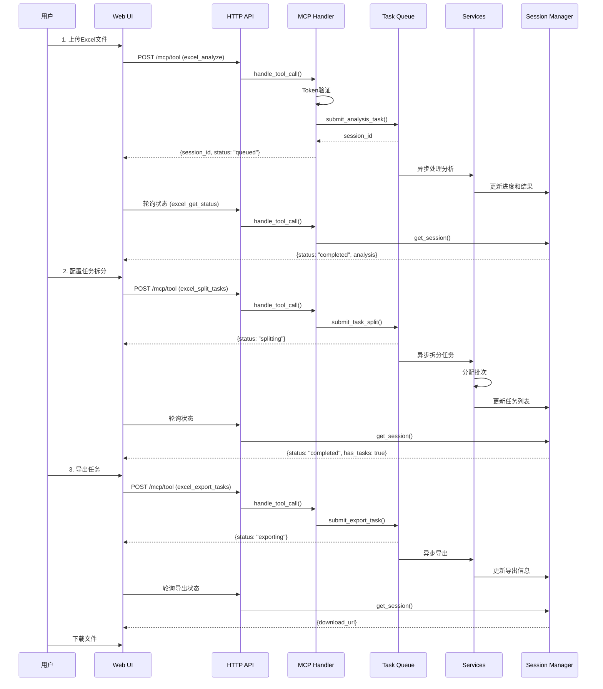

## Excel 分析流程

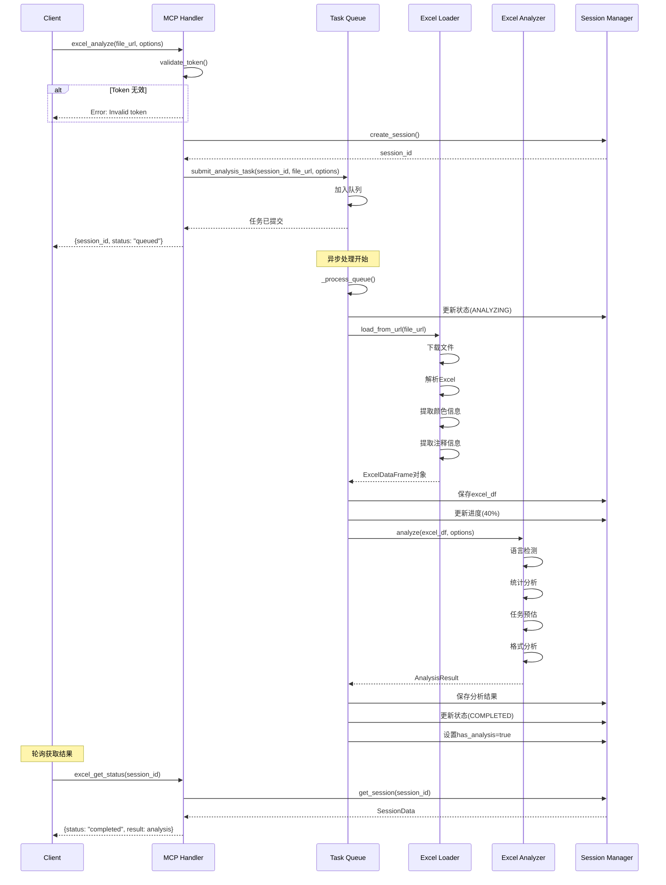

## 任务拆分流程

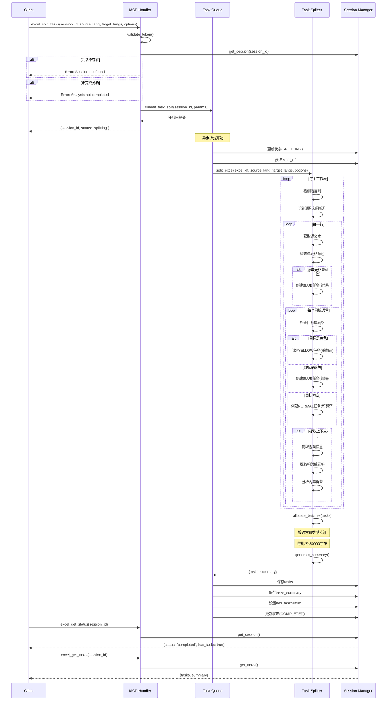

## 任务导出流程

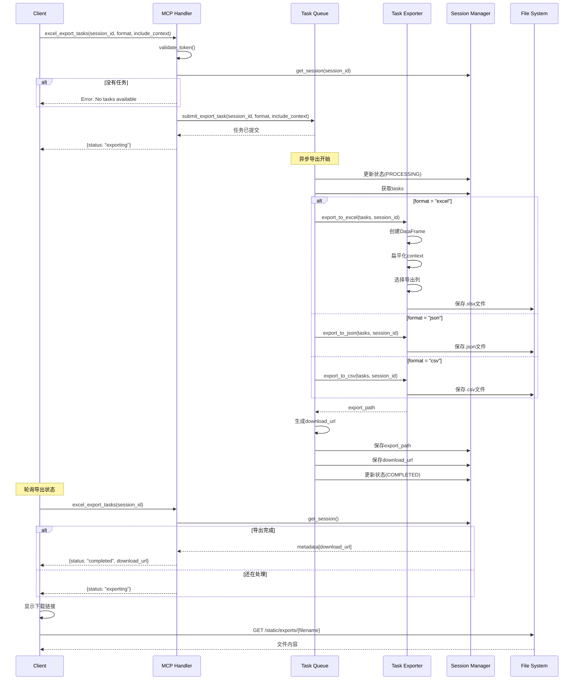

## 异步任务处理

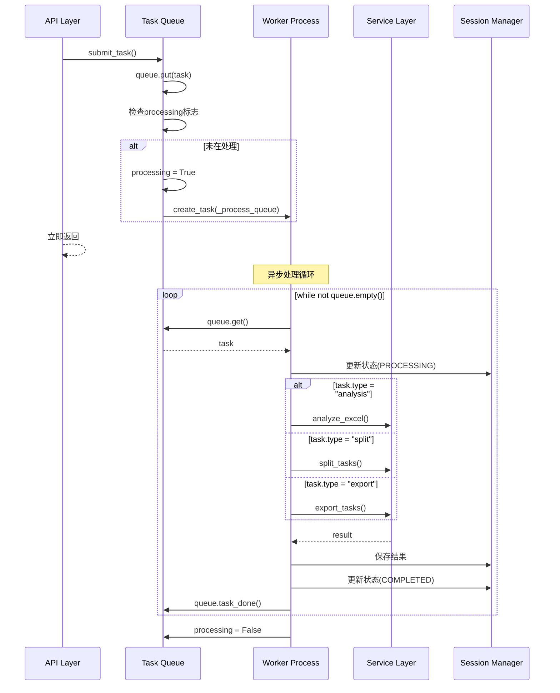

## 批次分配算法

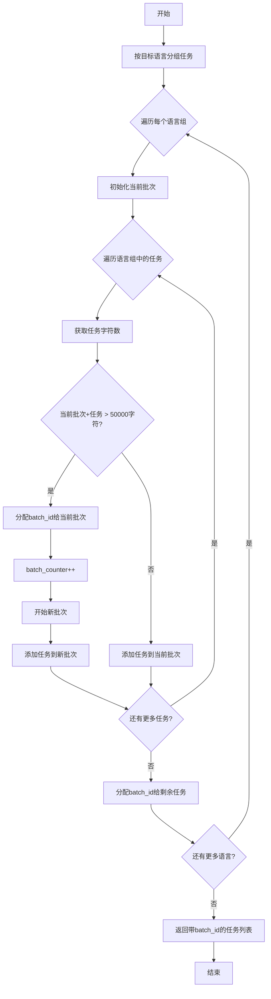

## 颜色检测流程

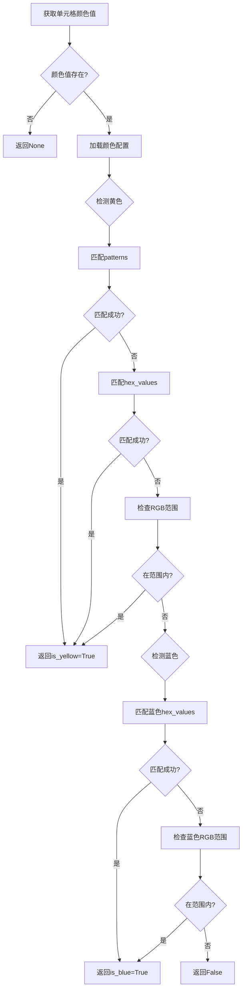

## 前端轮询机制

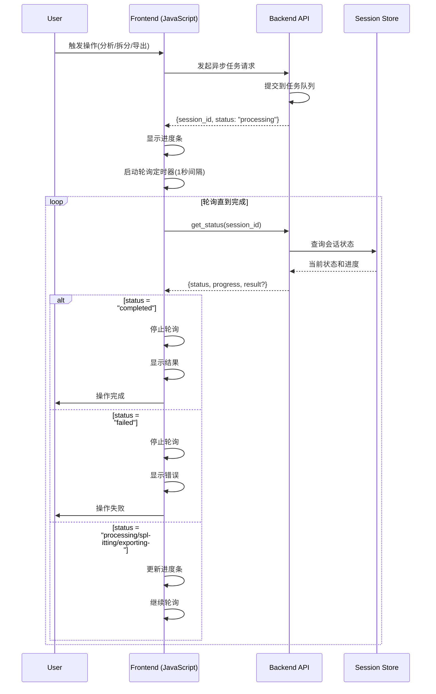

## 错误处理流程

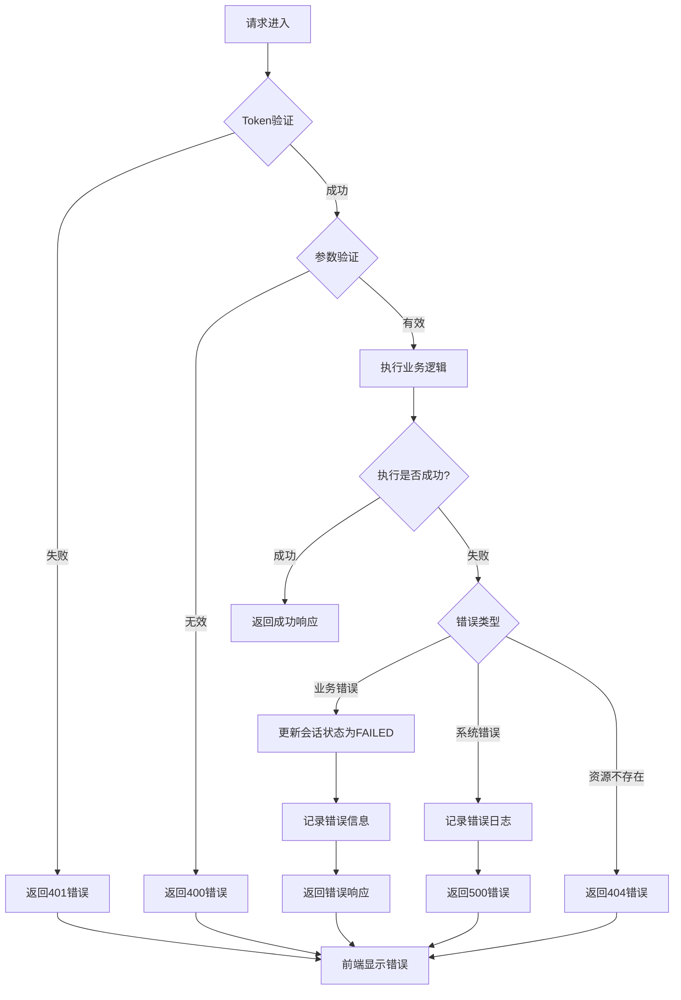

## 任务状态机

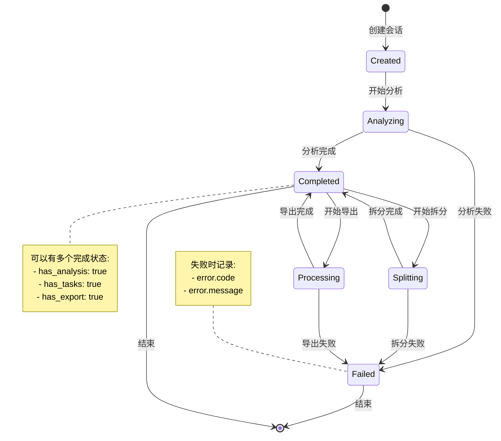

## 性能优化策略

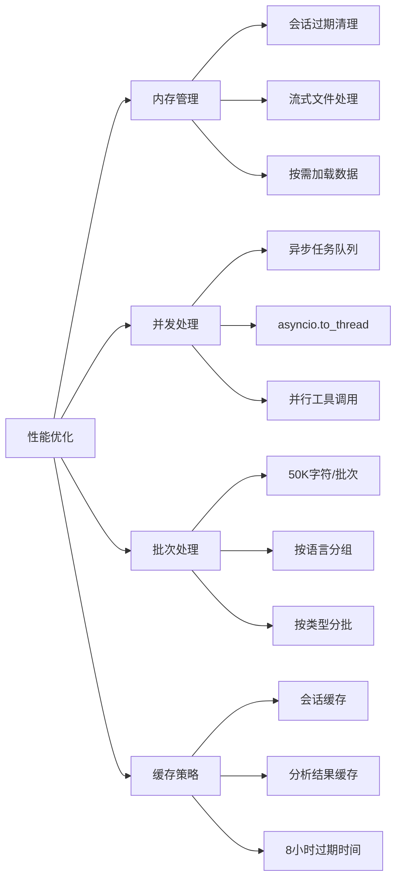

---

**版本**: v2.0.0
**更新日期**: 2025-10-03
**说明**: 本文档包含了 Excel MCP v2.0 的主要工作流程时序图和流程图