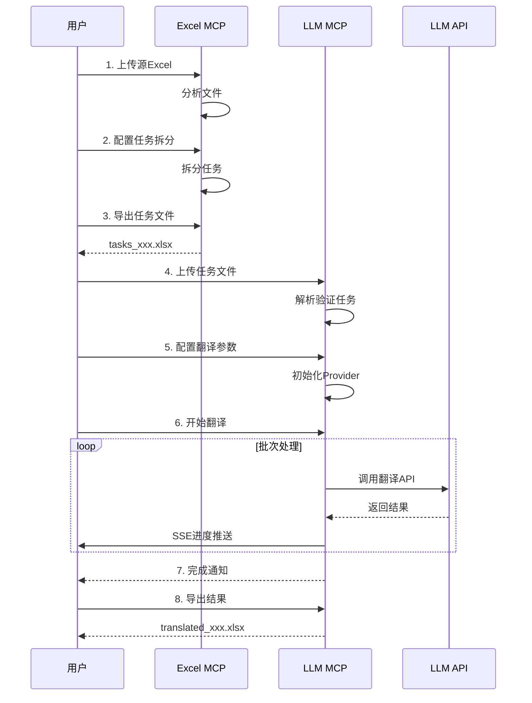
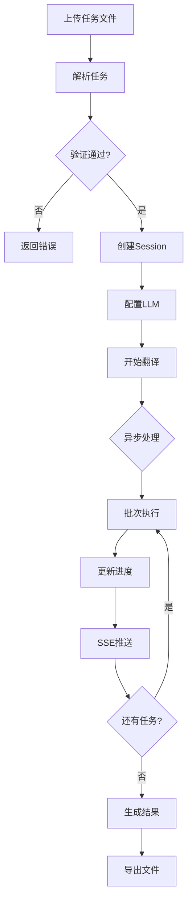

# LLM MCP 工作流集成文档

## 核心设计理念

### 简化架构
- **单端口服务**：8023 (HTTP + MCP)
- **使用 MCP 内置 SSE**：进度推送通过 MCP 协议的 progress 通知
- **无状态设计**：任务状态存储在 session 中
- **与 Excel MCP 一致**：相同的架构模式

## 完整翻译工作流

### 1. 端到端流程



### 2. 简化的任务处理流程



## 简化的 MCP 工具设计

### 核心工具（6个）

#### 1. llm_translate_tasks
**一站式翻译执行**
```json
{
  "name": "llm_translate_tasks",
  "description": "Upload and translate tasks in one call",
  "inputSchema": {
    "type": "object",
    "properties": {
      "token": {"type": "string"},
      "file": {"type": "string", "description": "Base64 encoded tasks file"},
      "file_url": {"type": "string", "description": "URL to tasks file"},
      "provider": {"type": "string", "enum": ["openai", "qwen", "anthropic"]},
      "model": {"type": "string"},
      "max_workers": {"type": "integer", "default": 5}
    },
    "required": ["token", "provider"]
  }
}
```

**返回**：
```json
{
  "session_id": "llm_xxx",
  "status": "translating",
  "message": "Translation started",
  "stats": {
    "total_tasks": 500,
    "estimated_time": 300,
    "estimated_cost": 2.50
  }
}
```

#### 2. llm_get_status
**获取翻译状态（带进度）**
```json
{
  "name": "llm_get_status",
  "description": "Get translation status with progress",
  "inputSchema": {
    "type": "object",
    "properties": {
      "token": {"type": "string"},
      "session_id": {"type": "string"}
    },
    "required": ["token", "session_id"]
  }
}
```

**返回**：
```json
{
  "session_id": "llm_xxx",
  "status": "translating",
  "progress": 45,
  "completed_tasks": 225,
  "total_tasks": 500,
  "failed_tasks": 3,
  "current_batch": 5,
  "total_batches": 10,
  "elapsed_time": 120,
  "estimated_remaining": 145,
  "current_cost": 1.14
}
```

#### 3. llm_pause_resume
**暂停/恢复翻译**
```json
{
  "name": "llm_pause_resume",
  "description": "Pause or resume translation",
  "inputSchema": {
    "type": "object",
    "properties": {
      "token": {"type": "string"},
      "session_id": {"type": "string"},
      "action": {"type": "string", "enum": ["pause", "resume"]}
    },
    "required": ["token", "session_id", "action"]
  }
}
```

#### 4. llm_get_results
**获取翻译结果**
```json
{
  "name": "llm_get_results",
  "description": "Get translation results",
  "inputSchema": {
    "type": "object",
    "properties": {
      "token": {"type": "string"},
      "session_id": {"type": "string"},
      "filter": {"type": "string", "enum": ["all", "completed", "failed"]},
      "preview_limit": {"type": "integer", "default": 10}
    },
    "required": ["token", "session_id"]
  }
}
```

#### 5. llm_export_results
**导出结果文件**
```json
{
  "name": "llm_export_results",
  "description": "Export translation results",
  "inputSchema": {
    "type": "object",
    "properties": {
      "token": {"type": "string"},
      "session_id": {"type": "string"},
      "format": {"type": "string", "enum": ["excel", "json"]},
      "merge_source": {"type": "boolean", "default": true}
    },
    "required": ["token", "session_id"]
  }
}
```

#### 6. llm_retry_failed
**重试失败任务**
```json
{
  "name": "llm_retry_failed",
  "description": "Retry failed translation tasks",
  "inputSchema": {
    "type": "object",
    "properties": {
      "token": {"type": "string"},
      "session_id": {"type": "string"},
      "task_ids": {"type": "array", "items": {"type": "string"}}
    },
    "required": ["token", "session_id"]
  }
}
```

## 进度推送机制

### 使用 MCP Progress Notifications

```python
# 服务端实现
class LLMHandler:
    async def handle_translate_tasks(self, arguments):
        session_id = self.create_session()

        # 启动异步翻译
        asyncio.create_task(self._execute_translation(session_id))

        # 立即返回
        return {
            "session_id": session_id,
            "status": "started"
        }

    async def _execute_translation(self, session_id):
        for batch in batches:
            # 处理批次
            results = await self.translate_batch(batch)

            # 发送进度通知
            await self.send_progress({
                "session_id": session_id,
                "type": "batch_complete",
                "batch_id": batch.id,
                "progress": calculate_progress(),
                "details": {
                    "completed": batch.completed,
                    "failed": batch.failed,
                    "tokens": batch.tokens_used
                }
            })
```

### 客户端接收进度

```javascript
// 使用 MCP 客户端订阅进度
const client = new MCPClient();

// 调用翻译工具
const result = await client.callTool('llm_translate_tasks', {
    token: 'xxx',
    file_url: 'http://xxx/tasks.xlsx',
    provider: 'openai'
});

// 监听进度通知
client.on('progress', (notification) => {
    if (notification.session_id === result.session_id) {
        updateProgressBar(notification.progress);
        updateStats(notification.details);
    }
});

// 或者轮询状态
const pollStatus = async () => {
    const status = await client.callTool('llm_get_status', {
        token: 'xxx',
        session_id: result.session_id
    });

    if (status.status === 'completed') {
        // 下载结果
        const export = await client.callTool('llm_export_results', {
            token: 'xxx',
            session_id: result.session_id
        });
    } else {
        setTimeout(pollStatus, 2000);
    }
};
```

## 数据格式兼容

### 输入格式（从 Excel MCP）

```excel
| task_id | batch_id | source_lang | source_text | target_lang | target_text | task_type | context |
|---------|----------|-------------|-------------|-------------|-------------|-----------|---------|
| task_1  | batch_1  | EN          | Hello       | TR          |             | normal    | {...}   |
```

### 输出格式（翻译结果）

```excel
| task_id | batch_id | source_lang | source_text | target_lang | target_text | task_type | status | tokens | cost |
|---------|----------|-------------|-------------|-------------|-------------|-----------|--------|--------|------|
| task_1  | batch_1  | EN          | Hello       | TR          | Merhaba     | normal    | done   | 10     | 0.001|
```

## 配置管理

### LLM Provider 配置

```yaml
# config/providers.yaml
providers:
  openai:
    api_key: ${OPENAI_API_KEY}
    endpoint: https://api.openai.com/v1
    models:
      - gpt-4-turbo
      - gpt-3.5-turbo
    default_model: gpt-4-turbo
    rate_limit:
      rpm: 10000
      tpm: 2000000
    pricing:
      gpt-4-turbo:
        input: 0.01   # per 1K tokens
        output: 0.03  # per 1K tokens

  qwen:
    api_key: ${QWEN_API_KEY}
    endpoint: https://dashscope.aliyuncs.com/api/v1
    models:
      - qwen-max
      - qwen-plus
    default_model: qwen-max
```

### 提示词模板

```yaml
# config/prompts.yaml
templates:
  normal:
    system: |
      You are a professional game translator.
      Translate the following text from {source_lang} to {target_lang}.
      Keep the same tone and style.
      Preserve any game-specific terminology.

    user: |
      Source text: {source_text}
      Context: {context}

      Translation:

  yellow:  # 重翻译
    system: |
      The following text needs retranslation.
      Previous translation may have issues.
      Provide a more accurate translation.

  blue:  # 缩短
    system: |
      The following text needs to be shortened.
      Keep the core meaning but make it more concise.
      Target length: 80% of original.
```

## 错误处理策略

### 自动重试机制

```python
RETRY_STRATEGY = {
    "rate_limit": {
        "max_retries": 5,
        "delays": [1, 2, 5, 10, 30],
        "backoff": "exponential"
    },
    "api_error": {
        "max_retries": 3,
        "delays": [1, 2, 5],
        "backoff": "linear"
    },
    "timeout": {
        "max_retries": 2,
        "delays": [5, 10],
        "backoff": "linear"
    }
}
```

### 错误分类和处理

| 错误类型 | 处理策略 | 用户提示 |
|---------|---------|---------|
| Rate Limit | 自动降速重试 | "API限流，自动降速处理中" |
| Invalid API Key | 停止执行 | "API密钥无效，请检查配置" |
| Network Error | 延迟重试 | "网络错误，正在重试" |
| Invalid Response | 记录并跳过 | "响应无效，已跳过该任务" |
| Budget Exceeded | 暂停执行 | "预算超限，已暂停" |

## 性能优化

### 批次大小动态调整

```python
def calculate_optimal_batch_size(avg_text_length: int, provider: str) -> int:
    """根据文本长度和提供者动态调整批次大小"""

    BASE_SIZES = {
        "openai": 10,
        "qwen": 15,
        "anthropic": 8
    }

    base = BASE_SIZES.get(provider, 10)

    if avg_text_length < 100:
        return base * 2  # 短文本，增加并发
    elif avg_text_length < 500:
        return base      # 中等文本
    else:
        return base // 2 # 长文本，减少并发
```

### 缓存策略

```python
# 使用 LRU 缓存相同文本的翻译
from functools import lru_cache

@lru_cache(maxsize=1000)
def get_cached_translation(
    text_hash: str,
    source_lang: str,
    target_lang: str,
    provider: str
) -> Optional[str]:
    """获取缓存的翻译结果"""
    return cache.get(f"{text_hash}:{source_lang}:{target_lang}:{provider}")
```

## 监控和日志

### 关键指标

```python
METRICS = {
    "translation_rate": "tasks/minute",
    "success_rate": "percentage",
    "average_latency": "milliseconds",
    "token_usage": "tokens/task",
    "cost_per_task": "USD",
    "queue_length": "tasks",
    "active_workers": "count"
}
```

### 日志级别

```python
import logging

logging.config = {
    "version": 1,
    "handlers": {
        "file": {
            "class": "logging.handlers.RotatingFileHandler",
            "filename": "/var/log/llm_mcp.log",
            "maxBytes": 10485760,  # 10MB
            "backupCount": 5
        }
    },
    "loggers": {
        "llm_mcp": {
            "level": "INFO",
            "handlers": ["file"]
        },
        "llm_mcp.api": {
            "level": "DEBUG"  # 详细的API调用日志
        }
    }
}
```

## 部署配置

### Docker 部署

```dockerfile
FROM python:3.10-slim

WORKDIR /app

COPY requirements.txt .
RUN pip install -r requirements.txt

COPY . .

ENV PYTHONUNBUFFERED=1
ENV PORT=8023

CMD ["python", "server.py", "--http"]
```

### docker-compose.yml

```yaml
version: '3.8'

services:
  llm_mcp:
    build: .
    ports:
      - "8023:8023"
    environment:
      - OPENAI_API_KEY=${OPENAI_API_KEY}
      - QWEN_API_KEY=${QWEN_API_KEY}
      - JWT_SECRET=${JWT_SECRET}
    volumes:
      - ./data:/data
      - ./exports:/exports
      - ./logs:/var/log
    restart: unless-stopped
```

## 测试策略

### 单元测试

```python
# tests/test_translator.py
import pytest
from services.translator import Translator

@pytest.mark.asyncio
async def test_translate_single_task():
    translator = Translator(provider="openai")
    result = await translator.translate(
        text="Hello",
        source_lang="EN",
        target_lang="TR"
    )
    assert result.text == "Merhaba"
    assert result.tokens > 0
```

### 集成测试

```python
# tests/test_integration.py
async def test_full_workflow():
    # 1. 上传任务
    session = await upload_tasks("test_tasks.xlsx")

    # 2. 开始翻译
    await start_translation(session.id)

    # 3. 等待完成
    await wait_for_completion(session.id)

    # 4. 验证结果
    results = await get_results(session.id)
    assert results.success_rate > 0.95
```

## 常见问题

### Q: 为什么不用 WebSocket？
**A**: MCP 协议本身支持 SSE 进度推送，不需要额外的 WebSocket 连接，保持架构简单。

### Q: 如何处理大文件？
**A**:
1. 流式读取，不一次性加载到内存
2. 分批处理，每批独立执行
3. 支持断点续传

### Q: 如何保证翻译质量？
**A**:
1. 使用高质量模型（GPT-4、Qwen-Max）
2. 提供上下文信息
3. 针对不同任务类型使用不同提示词
4. 支持人工审核和修正

### Q: 成本如何控制？
**A**:
1. 设置预算上限
2. 实时成本监控
3. 自动停止机制
4. 使用缓存减少重复调用

---

**版本**: v1.0.0
**更新日期**: 2025-10-03
**作者**: LLM MCP Team