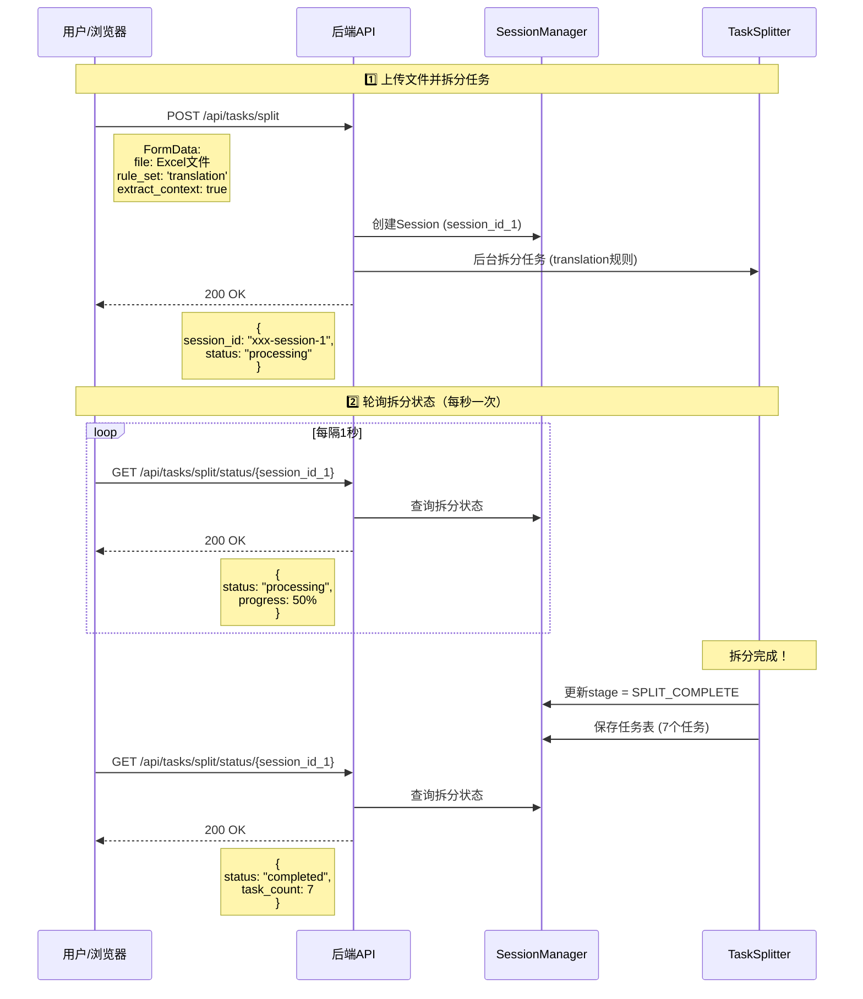
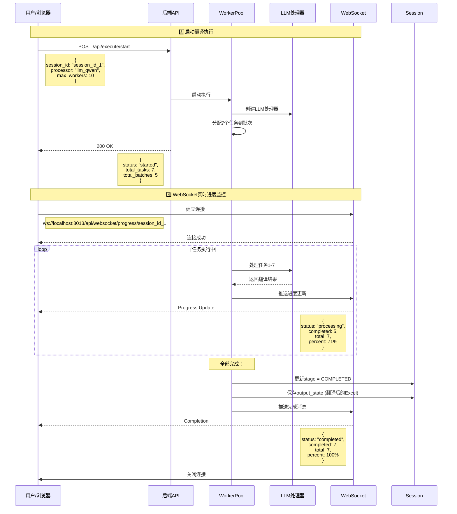
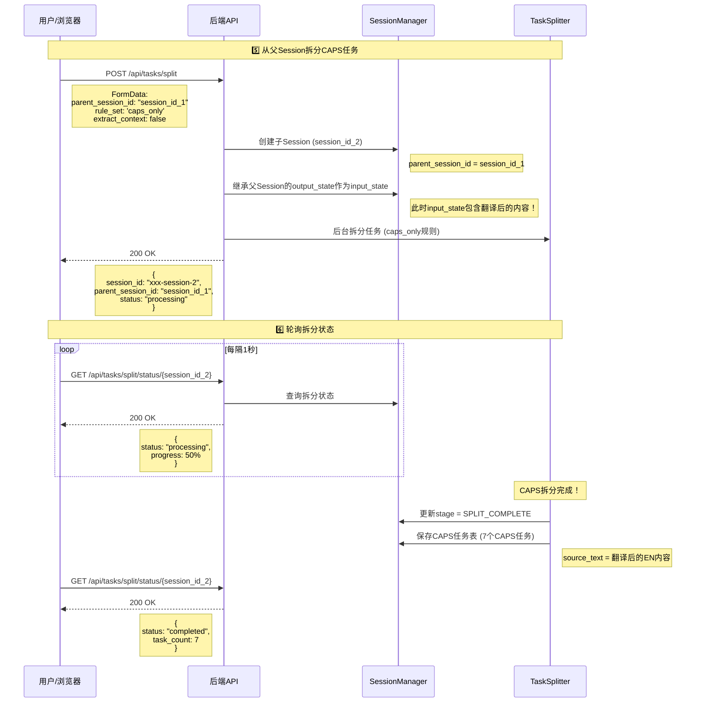
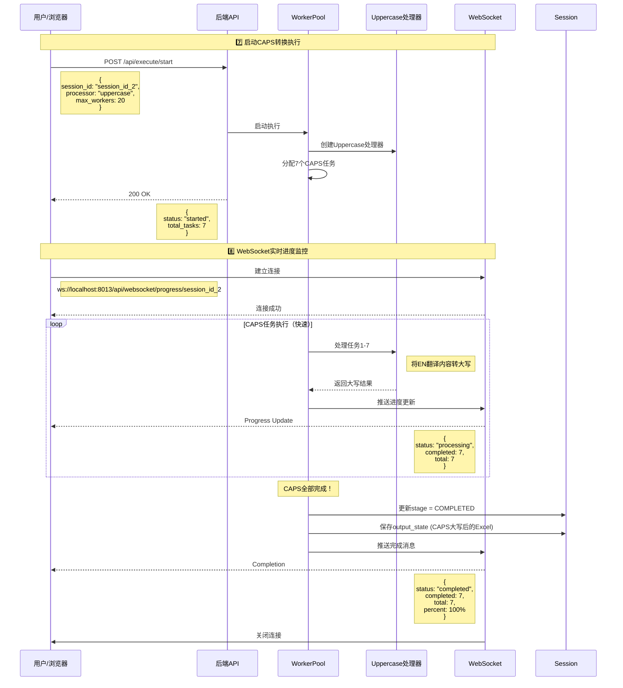
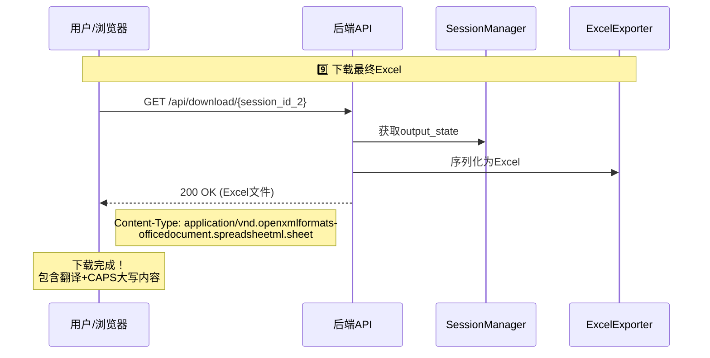

# API调用时序图 - 翻译系统完整流程

## 📋 概述

本文档展示了翻译系统从文件上传到CAPS转换的完整API调用时序。

---

## 🔄 阶段1：标准翻译流程

### 步骤1: 上传文件并拆分任务

```
测试页面: 1_upload_and_split.html
```

**API调用序列：**



**结果：**
- ✅ 获得 `session_id_1`
- ✅ Session状态: `SPLIT_COMPLETE`
- ✅ 任务数: 7个翻译任务

---

### 步骤2: 执行翻译

```
测试页面: 2_execute_transformation.html
填入: session_id_1
```

**API调用序列：**



**结果：**
- ✅ Session状态: `COMPLETED`
- ✅ 翻译完成: 7/7任务
- ✅ 可下载翻译后的Excel

---

## 🔄 阶段2：CAPS转换流程

### 步骤3: 使用父Session拆分CAPS任务

```
测试页面: 1_upload_and_split.html
填入: session_id_1 (作为parent_session_id)
选择: CAPS规则集
```

**API调用序列：**



**结果：**
- ✅ 获得 `session_id_2` (子Session)
- ✅ 父Session: `session_id_1`
- ✅ 任务数: 7个CAPS任务
- ✅ **关键：** source_text已经是翻译后的EN内容

---

### 步骤4: 执行CAPS转换

```
测试页面: 4_caps_transformation.html
填入: session_id_2
```

**API调用序列：**



**结果：**
- ✅ Session状态: `COMPLETED`
- ✅ CAPS转换完成: 7/7任务
- ✅ 可下载最终Excel（翻译+大写）

---

### 步骤5: 下载最终结果



---

## 📊 完整流程总结

### Session链关系

```
Session 1 (翻译阶段)
├── input_state: 原始Excel
├── tasks: 7个翻译任务
└── output_state: 翻译后Excel
      ↓
      继承
      ↓
Session 2 (CAPS阶段)
├── parent_session_id: Session 1
├── input_state: 翻译后Excel (继承自Session 1的output_state)
├── tasks: 7个CAPS任务
└── output_state: 最终Excel (翻译+大写)
```

### API端点使用总览

| 步骤 | API端点 | 方法 | 用途 | Session |
|------|---------|------|------|---------|
| 1 | `/api/tasks/split` | POST | 上传文件并拆分翻译任务 | session_1 (创建) |
| 2 | `/api/tasks/split/status/{id}` | GET | 轮询拆分状态（翻译） | session_1 (查询) |
| 3 | `/api/execute/start` | POST | 启动翻译执行 | session_1 (执行) |
| 4 | `ws://.../progress/{id}` | WS | 监控翻译进度 | session_1 (监控) |
| 5 | `/api/tasks/split` | POST | 从父Session拆分CAPS任务 | session_2 (创建) |
| 6 | `/api/tasks/split/status/{id}` | GET | 轮询拆分状态（CAPS） | session_2 (查询) |
| 7 | `/api/execute/start` | POST | 启动CAPS转换 | session_2 (执行) |
| 8 | `ws://.../progress/{id}` | WS | 监控CAPS进度 | session_2 (监控) |
| 9 | `/api/download/{id}` | GET | 下载最终Excel | session_2 (下载) |

### 关键时序点

1. **Split完成检测**：必须轮询直到 `status === 'completed'`
2. **Execute启动时机**：只能在Split完成后
3. **WebSocket连接**：Execute启动后立即建立
4. **父子Session继承**：Session 2的input_state来自Session 1的output_state
5. **CAPS任务的source_text**：在Session 2拆分时已经是翻译后的EN内容

---

## 🔍 与自动工作流的对比

### 手动测试（成功）

```
1. 上传 → session_1
2. 等待split完成（轮询）
3. Execute session_1 → 翻译完成
4. 继承session_1 → session_2
5. 等待split完成（轮询）
6. Execute session_2 → CAPS完成
```

### 自动工作流（当前实现）

```
1. 上传 → session_1
2. 等待split完成（waitForSplit）✅
3. Execute session_1 → 翻译开始
4. （这里可能还没完成就继续了）❌
5. 继承session_1 → session_2
6. 等待split完成（waitForSplit）
7. Execute session_2 → 可能失败（因为session_1还没完成）
```

### 问题分析

**自动工作流缺少的步骤：**
- ❌ 没有等待 **Execute完成**
- ❌ 只等待了Split完成
- ❌ 在翻译还没完成时就创建了子Session

**解决方案：**
需要添加 `waitForExecution` 方法，在步骤3和4之间等待执行完成！

---

## 📝 推荐的API调用模式

### 单个Session的完整周期

```javascript
// 1. 拆分
const splitResponse = await api.split(...);
const sessionId = splitResponse.session_id;

// 2. 等待拆分完成
await waitForSplit(sessionId);

// 3. 启动执行
await api.startExecution(sessionId, ...);

// 4. 等待执行完成（通过WebSocket或轮询）
await waitForExecution(sessionId);

// 5. 下载结果
await api.download(sessionId);
```

### Session链（多阶段Pipeline）

```javascript
// 阶段1：翻译
const session1 = await api.split({ file, rule_set: 'translation' });
await waitForSplit(session1.session_id);
await api.startExecution(session1.session_id, { processor: 'llm_qwen' });
await waitForExecution(session1.session_id); // ⭐ 关键：必须等待完成

// 阶段2：CAPS（继承阶段1的结果）
const session2 = await api.split({
  parent_session_id: session1.session_id,
  rule_set: 'caps_only'
});
await waitForSplit(session2.session_id);
await api.startExecution(session2.session_id, { processor: 'uppercase' });
await waitForExecution(session2.session_id); // ⭐ 等待完成

// 下载最终结果
await api.download(session2.session_id);
```

---

## 🎯 结论

你的手动测试流程完全正确！每个阶段都等待完成后再进入下一步。

**自动工作流需要修复的地方：**
1. 在 `executeTranslation` 和 `executeWithCapsWorkflow` 之间添加执行完成检测
2. 确保Session 1的翻译完全完成后，再创建Session 2
3. 可以通过WebSocket的完成消息或轮询 `/api/execute/status/{id}` 实现

生成时间: 2025-10-17
